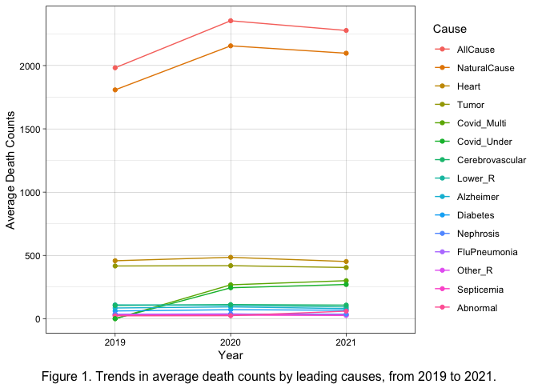
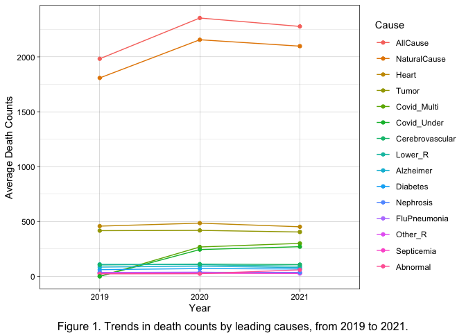
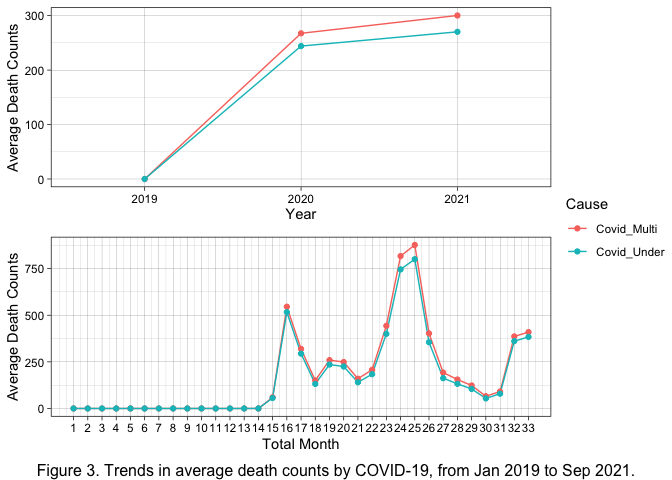
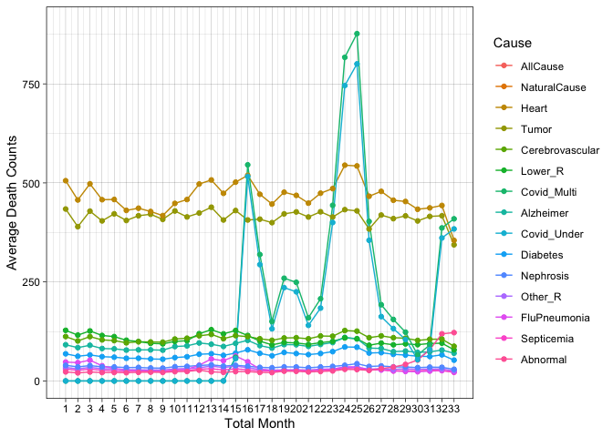
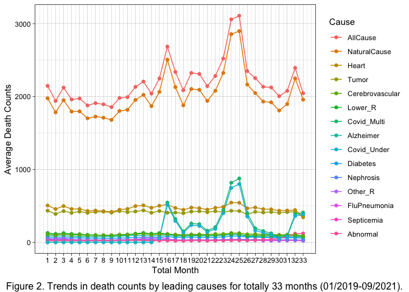
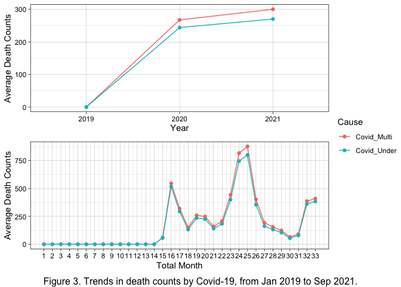
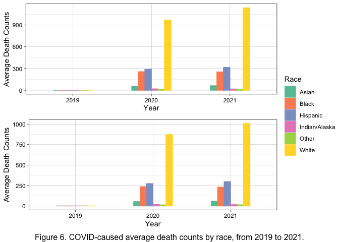
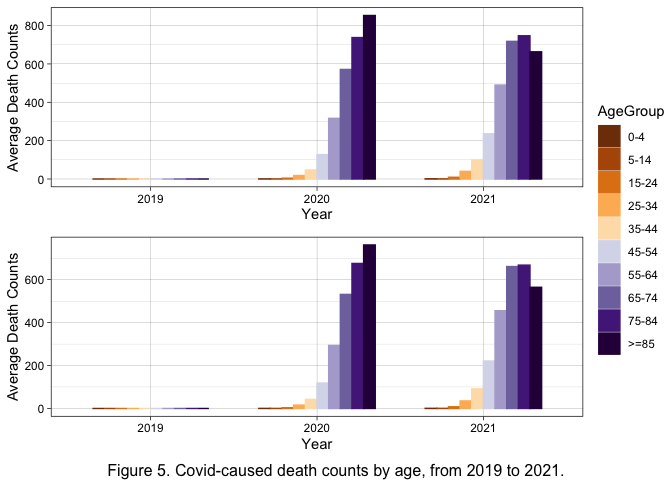

Analysis of Current Death Counts and Leading Causes in the US, focusing
on COVID-19
================
Yumeng Gao
2022-10-23

# Introduction

COVID-19 has gradually became one of the leading causes of death in the
US since its outbreak in 2020. According to US Center for Disease
Control and Prevention (CDC), the top 10 leading causes of death now
are: heart disease, cancer, COVID-19, accidents (unintentional
injuries), stroke (cerebrovascular diseases), chronic lower respiratory
diseases, Alzheimer’s disease, diabetes, influenza and pneumonia, as
well as nephritis, nephrotic syndrome, and nephrosis. Moreover, COVID-19
may interact with other diseases to impair the health conditions of its
hosts, eventually leading to death. Thus, it is pivotal to draw a
picture of COVID-19-attributed mortality with other leading causes of
death, to quantify the influence of this pandemic. This study focused on
the overall death counts in the US and leading causes, then narrowed
down to COVID-caused death counts in different age, sex, and race
groups. The primary research question was to what extent is the impact
of COVID-19 on mortality currently.

# Methods

The original dataset of this study was exported from CDC’s website: AH
Monthly Provisional Counts of Deaths for Select Causes of Death by Sex,
Age, and Race and Hispanic Origin
(<https://data.cdc.gov/NCHS/AH-Monthly-Provisional-Counts-of-Deaths-for-Select/65mz-jvh5>)
as a csv format.

After reading in the dataset, the variables with long names were renamed
for convenience. Then we checked the major elements of this dataset,
following with a closer look at the key variables (leading causes of
death) to check for missing values and outliers. For each categorical
variables, the name and order of categories were checked and corrected
if necessary.

To better interpret the data, we first summarized the average death
counts among different causes by year, then generated a scatter plot to
visualize the tendency of death counts by leading causes form 2019 to
2021. To get more details, the average death counts of different causes
by total 33 months were also created, following with paired scatter
plot. To emphasize COVID-19 multiple and underlying causes, we plotted
the related trends of death counts by year and by total month.

Then for the analysis narrowing down to COVID-19 multiple and underlying
causes, grouping by sex, age, and race groups. A summary table along
with bar chart were generated for each these three categorical variables
to present the difference of COVID-caused mortality among groups.

# Preliminary Results

The selected causes for this study were: 1. Natural Cause, 2.
Septicemia, 3. Malignant neoplasms, 4. Diabetes mellitus, 5. Alzheimer
disease, 6. Influenza and pneumonia, 7. Chronic lower respiratory
diseases, 8. Other diseases of respiratory system , 9. Nephritis,
nephrotic syndrome and nephrosis, 10. Symptoms, signs and abnormal
clinical and laboratory findings, not elsewhere classified, 11. Diseases
of heart, 12. Cerebrovascular diseases, 13. COVID-19 (Multiple Cause of
Death), 14. COVID-19 ( Underlying Cause of Death)

All Causes was also collected, however, it was not equal to the sum of
these individual causes, so the proportions were unable to calculate.

Download dataset from CDC’s website and read it in.

``` r
if (!file.exists("deaths.csv")) {
  download.file(
    url = "https://data.cdc.gov/api/views/65mz-jvh5/rows.csv?accessType=DOWNLOAD", "deaths.csv", method = "libcurl", timeout  = 60)
}
ah= data.table::fread("deaths.csv")
```

Change the names of the key variables so that they are easier to refer
to in the code.

``` r
setnames(ah, old = c('Date Of Death Year', 'Date Of Death Month', 'Race/Ethnicity' ,'Septicemia (A40-A41)', 'Malignant neoplasms (C00-C97)', 'Diabetes mellitus (E10-E14)', 'Alzheimer disease (G30)', 'Influenza and pneumonia (J09-J18)', 'Chronic lower respiratory diseases (J40-J47)', 'Other diseases of respiratory system (J00-J06,J30-J39,J67,J70-J98)', 'Nephritis, nephrotic syndrome and nephrosis (N00-N07,N17-N19,N25-N27)','Symptoms, signs and abnormal clinical and laboratory findings, not elsewhere classified (R00-R99)', 'Diseases of heart (I00-I09,I11,I13,I20-I51)' ,'Cerebrovascular diseases (I60-I69)' ,'COVID-19 (U071, Multiple Cause of Death)' ,'COVID-19 (U071, Underlying Cause of Death)'), new = c('Y', 'M', 'Race', 'Septicemia', 'Tumor', 'Diabetes', 'Alzheimer', 'FluPneumonia', 'Lower_R','Other_R' ,'Nephrosis', 'Abnormal', 'Heart', 'Cerebrovascular', 'Covid_Multi' ,'Covid_Under'))
```

-   Check Categorical Variables

``` r
ah$Year= format(ah$Y,format="%y")
ah$Month= format(ah$M,format="%m")
is.char= sapply(ah, is.character)
cate= ah[, ..is.char]
apply(cate, 2, table)
```

    ## $AnalysisDate
    ## 
    ## 10/13/2021 
    ##       3960 
    ## 
    ## $`Start Date`
    ## 
    ## 01/01/2019 01/01/2020 01/01/2021 02/01/2019 02/01/2020 02/01/2021 03/01/2019 
    ##        120        120        120        120        120        120        120 
    ## 03/01/2020 03/01/2021 04/01/2019 04/01/2020 04/01/2021 05/01/2019 05/01/2020 
    ##        120        120        120        120        120        120        120 
    ## 05/01/2021 06/01/2019 06/01/2020 06/01/2021 07/01/2019 07/01/2020 07/01/2021 
    ##        120        120        120        120        120        120        120 
    ## 08/01/2019 08/01/2020 08/01/2021 09/01/2019 09/01/2020 09/01/2021 10/01/2019 
    ##        120        120        120        120        120        120        120 
    ## 10/01/2020 11/01/2019 11/01/2020 12/01/2019 12/01/2020 
    ##        120        120        120        120        120 
    ## 
    ## $`End Date`
    ## 
    ## 01/31/2019 01/31/2020 01/31/2021 02/28/2019 02/28/2021 02/29/2020 03/31/2019 
    ##        120        120        120        120        120        120        120 
    ## 03/31/2020 03/31/2021 04/30/2019 04/30/2020 04/30/2021 05/31/2019 05/31/2020 
    ##        120        120        120        120        120        120        120 
    ## 05/31/2021 06/30/2019 06/30/2020 06/30/2021 07/31/2019 07/31/2020 07/31/2021 
    ##        120        120        120        120        120        120        120 
    ## 08/31/2019 08/31/2020 08/31/2021 09/30/2019 09/30/2020 09/30/2021 10/31/2019 
    ##        120        120        120        120        120        120        120 
    ## 10/31/2020 11/30/2019 11/30/2020 12/31/2019 12/31/2020 
    ##        120        120        120        120        120 
    ## 
    ## $`Jurisdiction of Occurrence`
    ## 
    ## United States 
    ##          3960 
    ## 
    ## $Sex
    ## 
    ##      F Female      M   Male 
    ##    720   1260    720   1260 
    ## 
    ## $Race
    ## 
    ##                                      Hispanic 
    ##                                           660 
    ## Non-Hispanic American Indian or Alaska Native 
    ##                                           660 
    ##                            Non-Hispanic Asian 
    ##                                           660 
    ##                            Non-Hispanic Black 
    ##                                           660 
    ##                            Non-Hispanic White 
    ##                                           660 
    ##                                         Other 
    ##                                           660 
    ## 
    ## $AgeGroup
    ## 
    ##         0-4 years       15-24 years       25-34 years       35-44 years 
    ##               396               396               396               396 
    ##       45-54 years        5-14 years       55-64 years       65-74 years 
    ##               396               396               396               396 
    ##       75-84 years 85 years and over 
    ##               396               396 
    ## 
    ## $Year
    ## 
    ## 2019 2020 2021 
    ## 1440 1440 1080 
    ## 
    ## $Month
    ## 
    ##   1   2   3   4   5   6   7   8   9  10  11  12 
    ## 360 360 360 360 360 360 360 360 360 240 240 240

Fix Sex’s problem.

``` r
ah= tibble::rowid_to_column(ah, "ID")

for (i in 1:length(ah$ID)){
  if (ah$Sex[i]== 'Female'){
    ah$Sex[i]= 'F'
  } else if (ah$Sex[i]== 'Male'){
    ah$Sex[i]= 'M'}
}

table(ah$Sex)
```

    ## 
    ##    F    M 
    ## 1980 1980

Rename race categories

``` r
for (i in 1:length(ah$ID)){
  if (ah$Race[i]== 'Non-Hispanic American Indian or Alaska Native'){
    ah$Race[i]= 'Indian/Alaska'
  } else if (ah$Race[i]== 'Non-Hispanic Asian'){
    ah$Race[i]= 'Asian'
    } else if (ah$Race[i]== 'Non-Hispanic Black'){
    ah$Race[i]= 'Black'
    } else if (ah$Race[i]== 'Non-Hispanic White'){
    ah$Race[i]= 'White'
}}

table(ah$Race)
```

    ## 
    ##         Asian         Black      Hispanic Indian/Alaska         Other 
    ##           660           660           660           660           660 
    ##         White 
    ##           660

Reorder age groups

``` r
is.factor(ah$AgeGroup)
```

    ## [1] FALSE

``` r
ah$AgeGroup= as.factor(ah$AgeGroup)

levels(ah$AgeGroup)
```

    ##  [1] "0-4 years"         "15-24 years"       "25-34 years"      
    ##  [4] "35-44 years"       "45-54 years"       "5-14 years"       
    ##  [7] "55-64 years"       "65-74 years"       "75-84 years"      
    ## [10] "85 years and over"

``` r
levels(ah$AgeGroup)= c('0-4', '15-24', '25-34', '35-44', '45-54', '5-14', '55-64', '65-74', '75-84', '>=85')

ah$AgeGroup= factor(ah$AgeGroup, levels=c('0-4', '5-14', '15-24', '25-34', '35-44', '45-54', '55-64', '65-74', '75-84', '>=85'))

table(ah$AgeGroup)
```

    ## 
    ##   0-4  5-14 15-24 25-34 35-44 45-54 55-64 65-74 75-84  >=85 
    ##   396   396   396   396   396   396   396   396   396   396

> Noted that sex, age, and race categories all have same sample size, so
> the death counts could also be considered as the proportions, eligible
> to be compared directly.

-   Check Numerical Variables

``` r
summary(ah[,11:25])
```

    ##     AllCause      NaturalCause     Septicemia         Tumor       
    ##  Min.   :    0   Min.   :    0   Min.   :  0.00   Min.   :   0.0  
    ##  1st Qu.:   73   1st Qu.:   45   1st Qu.:  0.00   1st Qu.:   5.0  
    ##  Median :  247   Median :  187   Median :  2.00   Median :  30.0  
    ##  Mean   : 2198   Mean   : 2013   Mean   : 27.07   Mean   : 414.0  
    ##  3rd Qu.: 1424   3rd Qu.: 1111   3rd Qu.: 15.00   3rd Qu.: 212.2  
    ##  Max.   :55227   Max.   :53946   Max.   :484.00   Max.   :6541.0  
    ##     Diabetes         Alzheimer        FluPneumonia        Lower_R      
    ##  Min.   :   0.00   Min.   :   0.00   Min.   :   0.00   Min.   :   0.0  
    ##  1st Qu.:   0.00   1st Qu.:   0.00   1st Qu.:   0.00   1st Qu.:   0.0  
    ##  Median :   8.00   Median :   0.00   Median :   3.00   Median :   4.0  
    ##  Mean   :  66.22   Mean   :  86.25   Mean   :  33.35   Mean   : 103.6  
    ##  3rd Qu.:  50.00   3rd Qu.:   6.00   3rd Qu.:  19.00   3rd Qu.:  22.0  
    ##  Max.   :1039.00   Max.   :4844.00   Max.   :1216.00   Max.   :2408.0  
    ##     Other_R         Nephrosis         Abnormal           Heart        
    ##  Min.   :  0.00   Min.   :  0.00   Min.   :   0.00   Min.   :    0.0  
    ##  1st Qu.:  0.00   1st Qu.:  0.00   1st Qu.:   1.00   1st Qu.:    3.0  
    ##  Median :  2.00   Median :  3.00   Median :   5.00   Median :   29.0  
    ##  Mean   : 30.75   Mean   : 36.04   Mean   :  33.06   Mean   :  465.9  
    ##  3rd Qu.: 14.00   3rd Qu.: 20.00   3rd Qu.:  22.25   3rd Qu.:  212.0  
    ##  Max.   :665.00   Max.   :651.00   Max.   :1308.00   Max.   :11502.0  
    ##  Cerebrovascular   Covid_Multi       Covid_Under     
    ##  Min.   :   0.0   Min.   :    0.0   Min.   :    0.0  
    ##  1st Qu.:   1.0   1st Qu.:    0.0   1st Qu.:    0.0  
    ##  Median :   6.0   Median :    0.0   Median :    0.0  
    ##  Mean   : 107.7   Mean   :  179.2   Mean   :  162.5  
    ##  3rd Qu.:  56.0   3rd Qu.:   37.0   3rd Qu.:   33.0  
    ##  Max.   :3483.0   Max.   :15441.0   Max.   :13510.0

> Since the death counts were wide-ranged integers, it’s hard to
> summarize the leading causes’ trends with the raw data. Thus, averages
> of death counts should be calculated for further analysis.

## 1. Overall Mortality Trends by Year

Table 1 presented the average death counts among different causes by
year.

``` r
tab1= as.tibble(group_by(ah, Year) %>% 
                       summarize( AllCause= mean(AllCause), NaturalCause= mean(NaturalCause), Septicemia= mean(Septicemia), Tumor= mean(Tumor), Diabetes= mean(Diabetes), Alzheimer= mean(Alzheimer),FluPneumonia= mean(FluPneumonia), Lower_R= mean(Lower_R), Other_R= mean(Other_R) ,Nephrosis= mean(Nephrosis), Abnormal= mean(Abnormal), Heart= mean(Heart), Cerebrovascular= mean(Cerebrovascular), Covid_Multi= mean(Covid_Multi) , Covid_Under= mean(Covid_Under)))
```

    ## Warning: `as.tibble()` was deprecated in tibble 2.0.0.
    ## Please use `as_tibble()` instead.
    ## The signature and semantics have changed, see `?as_tibble`.
    ## This warning is displayed once every 8 hours.
    ## Call `lifecycle::last_lifecycle_warnings()` to see where this warning was generated.

``` r
tab1 %>%
  kbl(caption = "Table 1. Summary of Average Death Counts for Leading Causes by Year") %>%
  kable_classic(full_width = F, html_font = "Cambria")
```

<table class=" lightable-classic" style="font-family: Cambria; width: auto !important; margin-left: auto; margin-right: auto;">
<caption>
Table 1. Summary of Average Death Counts for Leading Causes by Year
</caption>
<thead>
<tr>
<th style="text-align:left;">
Year
</th>
<th style="text-align:right;">
AllCause
</th>
<th style="text-align:right;">
NaturalCause
</th>
<th style="text-align:right;">
Septicemia
</th>
<th style="text-align:right;">
Tumor
</th>
<th style="text-align:right;">
Diabetes
</th>
<th style="text-align:right;">
Alzheimer
</th>
<th style="text-align:right;">
FluPneumonia
</th>
<th style="text-align:right;">
Lower_R
</th>
<th style="text-align:right;">
Other_R
</th>
<th style="text-align:right;">
Nephrosis
</th>
<th style="text-align:right;">
Abnormal
</th>
<th style="text-align:right;">
Heart
</th>
<th style="text-align:right;">
Cerebrovascular
</th>
<th style="text-align:right;">
Covid_Multi
</th>
<th style="text-align:right;">
Covid_Under
</th>
</tr>
</thead>
<tbody>
<tr>
<td style="text-align:left;">
2019
</td>
<td style="text-align:right;">
1982.424
</td>
<td style="text-align:right;">
1807.874
</td>
<td style="text-align:right;">
26.68750
</td>
<td style="text-align:right;">
416.3813
</td>
<td style="text-align:right;">
60.86389
</td>
<td style="text-align:right;">
84.37431
</td>
<td style="text-align:right;">
34.56944
</td>
<td style="text-align:right;">
109.00972
</td>
<td style="text-align:right;">
30.63194
</td>
<td style="text-align:right;">
35.80903
</td>
<td style="text-align:right;">
22.48056
</td>
<td style="text-align:right;">
457.6410
</td>
<td style="text-align:right;">
104.1667
</td>
<td style="text-align:right;">
0.0000
</td>
<td style="text-align:right;">
0.0000
</td>
</tr>
<tr>
<td style="text-align:left;">
2020
</td>
<td style="text-align:right;">
2354.156
</td>
<td style="text-align:right;">
2155.908
</td>
<td style="text-align:right;">
27.86319
</td>
<td style="text-align:right;">
418.8139
</td>
<td style="text-align:right;">
71.03819
</td>
<td style="text-align:right;">
93.25069
</td>
<td style="text-align:right;">
37.26597
</td>
<td style="text-align:right;">
106.09444
</td>
<td style="text-align:right;">
31.37292
</td>
<td style="text-align:right;">
36.52708
</td>
<td style="text-align:right;">
23.76597
</td>
<td style="text-align:right;">
484.8611
</td>
<td style="text-align:right;">
111.4681
</td>
<td style="text-align:right;">
267.5396
</td>
<td style="text-align:right;">
244.0965
</td>
</tr>
<tr>
<td style="text-align:left;">
2021
</td>
<td style="text-align:right;">
2277.359
</td>
<td style="text-align:right;">
2097.527
</td>
<td style="text-align:right;">
26.53611
</td>
<td style="text-align:right;">
404.3130
</td>
<td style="text-align:right;">
66.94722
</td>
<td style="text-align:right;">
79.40093
</td>
<td style="text-align:right;">
26.49722
</td>
<td style="text-align:right;">
93.01481
</td>
<td style="text-align:right;">
30.06852
</td>
<td style="text-align:right;">
35.70741
</td>
<td style="text-align:right;">
59.57500
</td>
<td style="text-align:right;">
451.7287
</td>
<td style="text-align:right;">
107.3963
</td>
<td style="text-align:right;">
300.2824
</td>
<td style="text-align:right;">
270.3046
</td>
</tr>
</tbody>
</table>

Generate a new dataset of average death counts with cause category by
year

``` r
c1= tab1 %>% pivot_longer(cols = c(AllCause, NaturalCause, Septicemia, Tumor, Diabetes, Alzheimer, FluPneumonia, Lower_R, Other_R, Nephrosis, Abnormal, Heart, Cerebrovascular, Covid_Multi, Covid_Under),
                           names_to = "Cause")
```

``` r
f1= c1 %>%
  mutate(Cause= fct_reorder(Cause, desc(value))) %>%
  ggplot(mapping= aes(x = Year, 
                     y = value, 
                     col = Cause, 
                     group = Cause)) +
  geom_line() + 
  geom_point() +
  ylab("Average Death Counts") + 
  theme_linedraw()

grid.arrange(f1, bottom="Figure 1. Trends in death counts by leading causes, from 2019 to 2021.")
```

<!-- -->

-   Zoom in to present those causes with relatively small counts

``` r
z1= f1 +ylim(0, 500)

z1
```

    ## Warning: Removed 6 row(s) containing missing values (geom_path).

    ## Warning: Removed 6 rows containing missing values (geom_point).

<!-- -->

## 2. Detailed Mortality Trends by Total Month

Generate new variable for total months counts

``` r
ah[, Month_total := fifelse(Y== 2019, M,
                   fifelse(Y== 2020, M+12, M+24))
    ]

table(ah$Month_total)
```

    ## 
    ##   1   2   3   4   5   6   7   8   9  10  11  12  13  14  15  16  17  18  19  20 
    ## 120 120 120 120 120 120 120 120 120 120 120 120 120 120 120 120 120 120 120 120 
    ##  21  22  23  24  25  26  27  28  29  30  31  32  33 
    ## 120 120 120 120 120 120 120 120 120 120 120 120 120

Calculate average death counts among different causes by total month

``` r
tab2= as.tibble(group_by(ah, Month_total) %>% 
                       summarize( AllCause= mean(AllCause), NaturalCause= mean(NaturalCause), Septicemia= mean(Septicemia), Tumor= mean(Tumor), Diabetes= mean(Diabetes), Alzheimer= mean(Alzheimer),FluPneumonia= mean(FluPneumonia), Lower_R= mean(Lower_R), Other_R= mean(Other_R) ,Nephrosis= mean(Nephrosis), Abnormal= mean(Abnormal), Heart= mean(Heart), Cerebrovascular= mean(Cerebrovascular), Covid_Multi= mean(Covid_Multi) , Covid_Under= mean(Covid_Under)))
```

Generate a new dataset of average death counts with cause category by
total year

``` r
c2= tab2 %>% pivot_longer(cols = c(AllCause, NaturalCause, Septicemia, Tumor, Diabetes, Alzheimer, FluPneumonia, Lower_R, Other_R, Nephrosis, Abnormal, Heart, Cerebrovascular, Covid_Multi, Covid_Under),
                           names_to = "Cause")
```

``` r
f2= c2 %>%
  mutate(Cause= fct_reorder(Cause, desc(value))) %>%
  ggplot(mapping= aes(x = Month_total, 
                     y = value, 
                     col = Cause, 
                     group = Cause)) +
  geom_line() + 
  geom_point() +
  ylab("Average Death Counts") +
  scale_x_continuous(name= "Total Month", breaks = seq(1, 33, by = 1)) +
  theme_linedraw()

grid.arrange(f2, bottom="Figure 2. Trends in death counts by leading causes for totally 33 months (01/2019-09/2021).")
```

<!-- -->

-   Zoom in to present those causes with relatively small counts

``` r
z2=f2 +ylim(0, 900)

z2
```

    ## Warning: Removed 66 row(s) containing missing values (geom_path).

    ## Warning: Removed 66 rows containing missing values (geom_point).

<!-- -->

## 3. COVID-Caused Mortality Trends

``` r
f3_1= subset(c1, Cause %in% "Covid_Multi" | Cause %in% "Covid_Under") %>%
  ggplot(mapping= aes(x = Year, 
                     y = value, 
                     col = Cause, 
                     group = Cause)) +
  geom_line() + 
  geom_point() +
  ylab("Average Death Counts") + 
  theme_linedraw()

f3_2= subset(c2, Cause %in% "Covid_Multi" | Cause %in% "Covid_Under") %>%
  ggplot(mapping= aes(x = Month_total, 
                     y = value, 
                     col = Cause, 
                     group = Cause)) +
  geom_line() + 
  geom_point() +
  ylab("Average Death Counts") +
  scale_x_continuous(name= "Total Month", breaks = seq(1, 33, by = 1)) +
  theme_linedraw()

f3= ggarrange(f3_1, f3_2, nrow=2, common.legend = TRUE, legend= "right")
grid.arrange(f3, bottom="Figure 3. Trends in death counts by COVID-19, from Jan 2019 to Sep 2021.")
```

<!-- -->

## 4. Visualiztion of COVID-caused Death Counts by Sex, Age, and Race

### By sex

``` r
s= as.tibble(group_by(ah, Year, Sex) %>% 
                       summarize( AllCause= mean(AllCause), Covid_Multi= mean(Covid_Multi) , Covid_Under= mean(Covid_Under)))
```

    ## `summarise()` has grouped output by 'Year'. You can override using the `.groups`
    ## argument.

``` r
knitr::kable(s, caption= "Table 2. Summary of COVID-caused Average Death Counts by Sex")
```

<table>
<caption>
Table 2. Summary of COVID-caused Average Death Counts by Sex
</caption>
<thead>
<tr>
<th style="text-align:left;">
Year
</th>
<th style="text-align:left;">
Sex
</th>
<th style="text-align:right;">
AllCause
</th>
<th style="text-align:right;">
Covid_Multi
</th>
<th style="text-align:right;">
Covid_Under
</th>
</tr>
</thead>
<tbody>
<tr>
<td style="text-align:left;">
2019
</td>
<td style="text-align:left;">
F
</td>
<td style="text-align:right;">
1918.015
</td>
<td style="text-align:right;">
0.0000
</td>
<td style="text-align:right;">
0.0000
</td>
</tr>
<tr>
<td style="text-align:left;">
2019
</td>
<td style="text-align:left;">
M
</td>
<td style="text-align:right;">
2046.833
</td>
<td style="text-align:right;">
0.0000
</td>
<td style="text-align:right;">
0.0000
</td>
</tr>
<tr>
<td style="text-align:left;">
2020
</td>
<td style="text-align:left;">
F
</td>
<td style="text-align:right;">
2243.901
</td>
<td style="text-align:right;">
244.4514
</td>
<td style="text-align:right;">
220.1292
</td>
</tr>
<tr>
<td style="text-align:left;">
2020
</td>
<td style="text-align:left;">
M
</td>
<td style="text-align:right;">
2464.411
</td>
<td style="text-align:right;">
290.6278
</td>
<td style="text-align:right;">
268.0639
</td>
</tr>
<tr>
<td style="text-align:left;">
2021
</td>
<td style="text-align:left;">
F
</td>
<td style="text-align:right;">
2137.974
</td>
<td style="text-align:right;">
264.1630
</td>
<td style="text-align:right;">
234.0370
</td>
</tr>
<tr>
<td style="text-align:left;">
2021
</td>
<td style="text-align:left;">
M
</td>
<td style="text-align:right;">
2416.744
</td>
<td style="text-align:right;">
336.4019
</td>
<td style="text-align:right;">
306.5722
</td>
</tr>
</tbody>
</table>

``` r
s %>%
  kbl(caption = "Table 2. Summary of COVID-caused Average Death Counts by Sex") %>%
  kable_classic(full_width = F, html_font = "Cambria")
```

<table class=" lightable-classic" style="font-family: Cambria; width: auto !important; margin-left: auto; margin-right: auto;">
<caption>
Table 2. Summary of COVID-caused Average Death Counts by Sex
</caption>
<thead>
<tr>
<th style="text-align:left;">
Year
</th>
<th style="text-align:left;">
Sex
</th>
<th style="text-align:right;">
AllCause
</th>
<th style="text-align:right;">
Covid_Multi
</th>
<th style="text-align:right;">
Covid_Under
</th>
</tr>
</thead>
<tbody>
<tr>
<td style="text-align:left;">
2019
</td>
<td style="text-align:left;">
F
</td>
<td style="text-align:right;">
1918.015
</td>
<td style="text-align:right;">
0.0000
</td>
<td style="text-align:right;">
0.0000
</td>
</tr>
<tr>
<td style="text-align:left;">
2019
</td>
<td style="text-align:left;">
M
</td>
<td style="text-align:right;">
2046.833
</td>
<td style="text-align:right;">
0.0000
</td>
<td style="text-align:right;">
0.0000
</td>
</tr>
<tr>
<td style="text-align:left;">
2020
</td>
<td style="text-align:left;">
F
</td>
<td style="text-align:right;">
2243.901
</td>
<td style="text-align:right;">
244.4514
</td>
<td style="text-align:right;">
220.1292
</td>
</tr>
<tr>
<td style="text-align:left;">
2020
</td>
<td style="text-align:left;">
M
</td>
<td style="text-align:right;">
2464.411
</td>
<td style="text-align:right;">
290.6278
</td>
<td style="text-align:right;">
268.0639
</td>
</tr>
<tr>
<td style="text-align:left;">
2021
</td>
<td style="text-align:left;">
F
</td>
<td style="text-align:right;">
2137.974
</td>
<td style="text-align:right;">
264.1630
</td>
<td style="text-align:right;">
234.0370
</td>
</tr>
<tr>
<td style="text-align:left;">
2021
</td>
<td style="text-align:left;">
M
</td>
<td style="text-align:right;">
2416.744
</td>
<td style="text-align:right;">
336.4019
</td>
<td style="text-align:right;">
306.5722
</td>
</tr>
</tbody>
</table>

``` r
c_s= s %>% pivot_longer(cols = c(AllCause, Covid_Multi, Covid_Under),
                           names_to = "Cause")
```

``` r
f4_1= subset(c_s, Cause %in% "Covid_Multi") %>%
  ggplot(mapping= aes(x = Year, 
                     y = value, 
                     col = Sex, 
                     fill = Sex)) +
  geom_bar(stat='identity', position = "dodge", width= 0.5) +
  ylab("Average Death Counts") +
  scale_color_grey() +
  scale_fill_grey() +
  theme_linedraw() +
  coord_flip()

f4_2= subset(c_s, Cause %in% "Covid_Under") %>%
  ggplot(mapping= aes(x = Year, 
                     y = value, 
                     col = Sex, 
                     fill = Sex)) +
  geom_bar(stat='identity', position = "dodge", width= 0.5) +
  ylab("Average Death Counts") +
  scale_color_grey() +
  scale_fill_grey() +
  theme_linedraw() +
  coord_flip() 

f4= ggarrange(f4_1, f4_2, nrow=2, common.legend = TRUE, legend= "right")
grid.arrange(f4, bottom="Figure 4. COVID-caused death counts by sex, from 2019 to 2021.")
```

<!-- -->

### By age

``` r
a= as.tibble(group_by(ah, Year, AgeGroup) %>% 
                       summarize( AllCause= mean(AllCause), Covid_Multi= mean(Covid_Multi) , Covid_Under= mean(Covid_Under)))
```

    ## `summarise()` has grouped output by 'Year'. You can override using the `.groups`
    ## argument.

``` r
a %>%
  kbl(caption = "Table 3. Summary of COVID-caused Average Death Counts by Age") %>%
  kable_classic(full_width = F, html_font = "Cambria")
```

<table class=" lightable-classic" style="font-family: Cambria; width: auto !important; margin-left: auto; margin-right: auto;">
<caption>
Table 3. Summary of COVID-caused Average Death Counts by Age
</caption>
<thead>
<tr>
<th style="text-align:left;">
Year
</th>
<th style="text-align:left;">
AgeGroup
</th>
<th style="text-align:right;">
AllCause
</th>
<th style="text-align:right;">
Covid_Multi
</th>
<th style="text-align:right;">
Covid_Under
</th>
</tr>
</thead>
<tbody>
<tr>
<td style="text-align:left;">
2019
</td>
<td style="text-align:left;">
0-4
</td>
<td style="text-align:right;">
170.81250
</td>
<td style="text-align:right;">
0.0000000
</td>
<td style="text-align:right;">
0.0000000
</td>
</tr>
<tr>
<td style="text-align:left;">
2019
</td>
<td style="text-align:left;">
5-14
</td>
<td style="text-align:right;">
38.17361
</td>
<td style="text-align:right;">
0.0000000
</td>
<td style="text-align:right;">
0.0000000
</td>
</tr>
<tr>
<td style="text-align:left;">
2019
</td>
<td style="text-align:left;">
15-24
</td>
<td style="text-align:right;">
206.74306
</td>
<td style="text-align:right;">
0.0000000
</td>
<td style="text-align:right;">
0.0000000
</td>
</tr>
<tr>
<td style="text-align:left;">
2019
</td>
<td style="text-align:left;">
25-34
</td>
<td style="text-align:right;">
410.95833
</td>
<td style="text-align:right;">
0.0000000
</td>
<td style="text-align:right;">
0.0000000
</td>
</tr>
<tr>
<td style="text-align:left;">
2019
</td>
<td style="text-align:left;">
35-44
</td>
<td style="text-align:right;">
576.29167
</td>
<td style="text-align:right;">
0.0000000
</td>
<td style="text-align:right;">
0.0000000
</td>
</tr>
<tr>
<td style="text-align:left;">
2019
</td>
<td style="text-align:left;">
45-54
</td>
<td style="text-align:right;">
1113.84028
</td>
<td style="text-align:right;">
0.0000000
</td>
<td style="text-align:right;">
0.0000000
</td>
</tr>
<tr>
<td style="text-align:left;">
2019
</td>
<td style="text-align:left;">
55-64
</td>
<td style="text-align:right;">
2603.72917
</td>
<td style="text-align:right;">
0.0000000
</td>
<td style="text-align:right;">
0.0000000
</td>
</tr>
<tr>
<td style="text-align:left;">
2019
</td>
<td style="text-align:left;">
65-74
</td>
<td style="text-align:right;">
3858.04861
</td>
<td style="text-align:right;">
0.0000000
</td>
<td style="text-align:right;">
0.0000000
</td>
</tr>
<tr>
<td style="text-align:left;">
2019
</td>
<td style="text-align:left;">
75-84
</td>
<td style="text-align:right;">
4777.96528
</td>
<td style="text-align:right;">
0.0000000
</td>
<td style="text-align:right;">
0.0000000
</td>
</tr>
<tr>
<td style="text-align:left;">
2019
</td>
<td style="text-align:left;">
\>=85
</td>
<td style="text-align:right;">
6067.68056
</td>
<td style="text-align:right;">
0.0000000
</td>
<td style="text-align:right;">
0.0000000
</td>
</tr>
<tr>
<td style="text-align:left;">
2020
</td>
<td style="text-align:left;">
0-4
</td>
<td style="text-align:right;">
161.00000
</td>
<td style="text-align:right;">
0.5347222
</td>
<td style="text-align:right;">
0.3750000
</td>
</tr>
<tr>
<td style="text-align:left;">
2020
</td>
<td style="text-align:left;">
5-14
</td>
<td style="text-align:right;">
39.19444
</td>
<td style="text-align:right;">
0.4722222
</td>
<td style="text-align:right;">
0.3402778
</td>
</tr>
<tr>
<td style="text-align:left;">
2020
</td>
<td style="text-align:left;">
15-24
</td>
<td style="text-align:right;">
250.10417
</td>
<td style="text-align:right;">
4.2638889
</td>
<td style="text-align:right;">
3.4791667
</td>
</tr>
<tr>
<td style="text-align:left;">
2020
</td>
<td style="text-align:left;">
25-34
</td>
<td style="text-align:right;">
513.07639
</td>
<td style="text-align:right;">
18.1944444
</td>
<td style="text-align:right;">
15.7083333
</td>
</tr>
<tr>
<td style="text-align:left;">
2020
</td>
<td style="text-align:left;">
35-44
</td>
<td style="text-align:right;">
729.06250
</td>
<td style="text-align:right;">
47.0694444
</td>
<td style="text-align:right;">
42.3402778
</td>
</tr>
<tr>
<td style="text-align:left;">
2020
</td>
<td style="text-align:left;">
45-54
</td>
<td style="text-align:right;">
1333.21528
</td>
<td style="text-align:right;">
127.1875000
</td>
<td style="text-align:right;">
118.2291667
</td>
</tr>
<tr>
<td style="text-align:left;">
2020
</td>
<td style="text-align:left;">
55-64
</td>
<td style="text-align:right;">
3069.50000
</td>
<td style="text-align:right;">
316.3263889
</td>
<td style="text-align:right;">
293.4305556
</td>
</tr>
<tr>
<td style="text-align:left;">
2020
</td>
<td style="text-align:left;">
65-74
</td>
<td style="text-align:right;">
4693.91667
</td>
<td style="text-align:right;">
571.1875000
</td>
<td style="text-align:right;">
530.9513889
</td>
</tr>
<tr>
<td style="text-align:left;">
2020
</td>
<td style="text-align:left;">
75-84
</td>
<td style="text-align:right;">
5715.49306
</td>
<td style="text-align:right;">
737.5277778
</td>
<td style="text-align:right;">
675.0347222
</td>
</tr>
<tr>
<td style="text-align:left;">
2020
</td>
<td style="text-align:left;">
\>=85
</td>
<td style="text-align:right;">
7037.00000
</td>
<td style="text-align:right;">
852.6319444
</td>
<td style="text-align:right;">
761.0763889
</td>
</tr>
<tr>
<td style="text-align:left;">
2021
</td>
<td style="text-align:left;">
0-4
</td>
<td style="text-align:right;">
149.30556
</td>
<td style="text-align:right;">
1.0092593
</td>
<td style="text-align:right;">
0.6666667
</td>
</tr>
<tr>
<td style="text-align:left;">
2021
</td>
<td style="text-align:left;">
5-14
</td>
<td style="text-align:right;">
38.60185
</td>
<td style="text-align:right;">
0.8981481
</td>
<td style="text-align:right;">
0.6203704
</td>
</tr>
<tr>
<td style="text-align:left;">
2021
</td>
<td style="text-align:left;">
15-24
</td>
<td style="text-align:right;">
252.41667
</td>
<td style="text-align:right;">
9.0648148
</td>
<td style="text-align:right;">
7.7129630
</td>
</tr>
<tr>
<td style="text-align:left;">
2021
</td>
<td style="text-align:left;">
25-34
</td>
<td style="text-align:right;">
538.61111
</td>
<td style="text-align:right;">
39.8148148
</td>
<td style="text-align:right;">
35.1203704
</td>
</tr>
<tr>
<td style="text-align:left;">
2021
</td>
<td style="text-align:left;">
35-44
</td>
<td style="text-align:right;">
805.20370
</td>
<td style="text-align:right;">
98.8425926
</td>
<td style="text-align:right;">
91.1944444
</td>
</tr>
<tr>
<td style="text-align:left;">
2021
</td>
<td style="text-align:left;">
45-54
</td>
<td style="text-align:right;">
1402.75000
</td>
<td style="text-align:right;">
235.6111111
</td>
<td style="text-align:right;">
220.8796296
</td>
</tr>
<tr>
<td style="text-align:left;">
2021
</td>
<td style="text-align:left;">
55-64
</td>
<td style="text-align:right;">
3122.27778
</td>
<td style="text-align:right;">
489.8055556
</td>
<td style="text-align:right;">
454.9722222
</td>
</tr>
<tr>
<td style="text-align:left;">
2021
</td>
<td style="text-align:left;">
65-74
</td>
<td style="text-align:right;">
4747.54630
</td>
<td style="text-align:right;">
717.7129630
</td>
<td style="text-align:right;">
660.5833333
</td>
</tr>
<tr>
<td style="text-align:left;">
2021
</td>
<td style="text-align:left;">
75-84
</td>
<td style="text-align:right;">
5464.61111
</td>
<td style="text-align:right;">
746.8611111
</td>
<td style="text-align:right;">
667.2222222
</td>
</tr>
<tr>
<td style="text-align:left;">
2021
</td>
<td style="text-align:left;">
\>=85
</td>
<td style="text-align:right;">
6252.26852
</td>
<td style="text-align:right;">
663.2037037
</td>
<td style="text-align:right;">
564.0740741
</td>
</tr>
</tbody>
</table>

``` r
c_a= a %>% pivot_longer(cols = c(AllCause, Covid_Multi, Covid_Under),
                           names_to = "Cause")
```

``` r
f5_1= subset(c_a, Cause %in% "Covid_Multi") %>%
  ggplot(mapping= aes(x = Year, 
                     y = value, 
                     col = AgeGroup, 
                     fill = AgeGroup)) +
  geom_bar(stat='identity', position = "dodge", width= 0.7) +
  ylab("Average Death Counts") +
  scale_color_brewer(palette="PuOr") +
  scale_fill_brewer(palette="PuOr") +
  theme_linedraw()

f5_2= subset(c_a, Cause %in% "Covid_Under") %>%
  ggplot(mapping= aes(x = Year, 
                     y = value, 
                     col = AgeGroup, 
                     fill = AgeGroup)) +
  geom_bar(stat='identity', position = "dodge", width= 0.7) +
  ylab("Average Death Counts") +
  scale_color_brewer(palette="PuOr") +
  scale_fill_brewer(palette="PuOr") +
  theme_linedraw()

f5= ggarrange(f5_1, f5_2, nrow=2, common.legend = TRUE, legend= "right")
grid.arrange(f5, bottom="Figure 5. COVID-caused death counts by age, from 2019 to 2021.")
```

<!-- -->

### By race

``` r
r= as.tibble(group_by(ah, Year, Race) %>% 
                       summarize( AllCause= mean(AllCause), Covid_Multi= mean(Covid_Multi) , Covid_Under= mean(Covid_Under)))
```

    ## `summarise()` has grouped output by 'Year'. You can override using the `.groups`
    ## argument.

``` r
knitr::kable(r, caption= "")
```

<table>
<caption>
</caption>
<thead>
<tr>
<th style="text-align:left;">
Year
</th>
<th style="text-align:left;">
Race
</th>
<th style="text-align:right;">
AllCause
</th>
<th style="text-align:right;">
Covid_Multi
</th>
<th style="text-align:right;">
Covid_Under
</th>
</tr>
</thead>
<tbody>
<tr>
<td style="text-align:left;">
2019
</td>
<td style="text-align:left;">
Asian
</td>
<td style="text-align:right;">
293.87500
</td>
<td style="text-align:right;">
0.00000
</td>
<td style="text-align:right;">
0.00000
</td>
</tr>
<tr>
<td style="text-align:left;">
2019
</td>
<td style="text-align:left;">
Black
</td>
<td style="text-align:right;">
1444.40833
</td>
<td style="text-align:right;">
0.00000
</td>
<td style="text-align:right;">
0.00000
</td>
</tr>
<tr>
<td style="text-align:left;">
2019
</td>
<td style="text-align:left;">
Hispanic
</td>
<td style="text-align:right;">
884.94583
</td>
<td style="text-align:right;">
0.00000
</td>
<td style="text-align:right;">
0.00000
</td>
</tr>
<tr>
<td style="text-align:left;">
2019
</td>
<td style="text-align:left;">
Indian/Alaska
</td>
<td style="text-align:right;">
75.23750
</td>
<td style="text-align:right;">
0.00000
</td>
<td style="text-align:right;">
0.00000
</td>
</tr>
<tr>
<td style="text-align:left;">
2019
</td>
<td style="text-align:left;">
Other
</td>
<td style="text-align:right;">
96.94583
</td>
<td style="text-align:right;">
0.00000
</td>
<td style="text-align:right;">
0.00000
</td>
</tr>
<tr>
<td style="text-align:left;">
2019
</td>
<td style="text-align:left;">
White
</td>
<td style="text-align:right;">
9099.13333
</td>
<td style="text-align:right;">
0.00000
</td>
<td style="text-align:right;">
0.00000
</td>
</tr>
<tr>
<td style="text-align:left;">
2020
</td>
<td style="text-align:left;">
Asian
</td>
<td style="text-align:right;">
381.62917
</td>
<td style="text-align:right;">
56.54583
</td>
<td style="text-align:right;">
53.07500
</td>
</tr>
<tr>
<td style="text-align:left;">
2020
</td>
<td style="text-align:left;">
Black
</td>
<td style="text-align:right;">
1875.12083
</td>
<td style="text-align:right;">
256.13750
</td>
<td style="text-align:right;">
235.21250
</td>
</tr>
<tr>
<td style="text-align:left;">
2020
</td>
<td style="text-align:left;">
Hispanic
</td>
<td style="text-align:right;">
1281.43750
</td>
<td style="text-align:right;">
289.31250
</td>
<td style="text-align:right;">
273.25000
</td>
</tr>
<tr>
<td style="text-align:left;">
2020
</td>
<td style="text-align:left;">
Indian/Alaska
</td>
<td style="text-align:right;">
103.10833
</td>
<td style="text-align:right;">
19.23333
</td>
<td style="text-align:right;">
17.77917
</td>
</tr>
<tr>
<td style="text-align:left;">
2020
</td>
<td style="text-align:left;">
Other
</td>
<td style="text-align:right;">
122.26250
</td>
<td style="text-align:right;">
14.26250
</td>
<td style="text-align:right;">
13.17500
</td>
</tr>
<tr>
<td style="text-align:left;">
2020
</td>
<td style="text-align:left;">
White
</td>
<td style="text-align:right;">
10361.37917
</td>
<td style="text-align:right;">
969.74583
</td>
<td style="text-align:right;">
872.08750
</td>
</tr>
<tr>
<td style="text-align:left;">
2021
</td>
<td style="text-align:left;">
Asian
</td>
<td style="text-align:right;">
378.57778
</td>
<td style="text-align:right;">
62.75000
</td>
<td style="text-align:right;">
58.54444
</td>
</tr>
<tr>
<td style="text-align:left;">
2021
</td>
<td style="text-align:left;">
Black
</td>
<td style="text-align:right;">
1761.60000
</td>
<td style="text-align:right;">
253.45000
</td>
<td style="text-align:right;">
229.17222
</td>
</tr>
<tr>
<td style="text-align:left;">
2021
</td>
<td style="text-align:left;">
Hispanic
</td>
<td style="text-align:right;">
1290.42222
</td>
<td style="text-align:right;">
314.92778
</td>
<td style="text-align:right;">
296.87778
</td>
</tr>
<tr>
<td style="text-align:left;">
2021
</td>
<td style="text-align:left;">
Indian/Alaska
</td>
<td style="text-align:right;">
100.41667
</td>
<td style="text-align:right;">
17.62222
</td>
<td style="text-align:right;">
16.15000
</td>
</tr>
<tr>
<td style="text-align:left;">
2021
</td>
<td style="text-align:left;">
Other
</td>
<td style="text-align:right;">
120.27222
</td>
<td style="text-align:right;">
15.22778
</td>
<td style="text-align:right;">
13.80556
</td>
</tr>
<tr>
<td style="text-align:left;">
2021
</td>
<td style="text-align:left;">
White
</td>
<td style="text-align:right;">
10012.86667
</td>
<td style="text-align:right;">
1137.71667
</td>
<td style="text-align:right;">
1007.27778
</td>
</tr>
</tbody>
</table>

``` r
r %>%
  kbl(caption = "Table 4. Summary of COVID-caused Average Death Counts by Race") %>%
  kable_classic(full_width = F, html_font = "Cambria")
```

<table class=" lightable-classic" style="font-family: Cambria; width: auto !important; margin-left: auto; margin-right: auto;">
<caption>
Table 4. Summary of COVID-caused Average Death Counts by Race
</caption>
<thead>
<tr>
<th style="text-align:left;">
Year
</th>
<th style="text-align:left;">
Race
</th>
<th style="text-align:right;">
AllCause
</th>
<th style="text-align:right;">
Covid_Multi
</th>
<th style="text-align:right;">
Covid_Under
</th>
</tr>
</thead>
<tbody>
<tr>
<td style="text-align:left;">
2019
</td>
<td style="text-align:left;">
Asian
</td>
<td style="text-align:right;">
293.87500
</td>
<td style="text-align:right;">
0.00000
</td>
<td style="text-align:right;">
0.00000
</td>
</tr>
<tr>
<td style="text-align:left;">
2019
</td>
<td style="text-align:left;">
Black
</td>
<td style="text-align:right;">
1444.40833
</td>
<td style="text-align:right;">
0.00000
</td>
<td style="text-align:right;">
0.00000
</td>
</tr>
<tr>
<td style="text-align:left;">
2019
</td>
<td style="text-align:left;">
Hispanic
</td>
<td style="text-align:right;">
884.94583
</td>
<td style="text-align:right;">
0.00000
</td>
<td style="text-align:right;">
0.00000
</td>
</tr>
<tr>
<td style="text-align:left;">
2019
</td>
<td style="text-align:left;">
Indian/Alaska
</td>
<td style="text-align:right;">
75.23750
</td>
<td style="text-align:right;">
0.00000
</td>
<td style="text-align:right;">
0.00000
</td>
</tr>
<tr>
<td style="text-align:left;">
2019
</td>
<td style="text-align:left;">
Other
</td>
<td style="text-align:right;">
96.94583
</td>
<td style="text-align:right;">
0.00000
</td>
<td style="text-align:right;">
0.00000
</td>
</tr>
<tr>
<td style="text-align:left;">
2019
</td>
<td style="text-align:left;">
White
</td>
<td style="text-align:right;">
9099.13333
</td>
<td style="text-align:right;">
0.00000
</td>
<td style="text-align:right;">
0.00000
</td>
</tr>
<tr>
<td style="text-align:left;">
2020
</td>
<td style="text-align:left;">
Asian
</td>
<td style="text-align:right;">
381.62917
</td>
<td style="text-align:right;">
56.54583
</td>
<td style="text-align:right;">
53.07500
</td>
</tr>
<tr>
<td style="text-align:left;">
2020
</td>
<td style="text-align:left;">
Black
</td>
<td style="text-align:right;">
1875.12083
</td>
<td style="text-align:right;">
256.13750
</td>
<td style="text-align:right;">
235.21250
</td>
</tr>
<tr>
<td style="text-align:left;">
2020
</td>
<td style="text-align:left;">
Hispanic
</td>
<td style="text-align:right;">
1281.43750
</td>
<td style="text-align:right;">
289.31250
</td>
<td style="text-align:right;">
273.25000
</td>
</tr>
<tr>
<td style="text-align:left;">
2020
</td>
<td style="text-align:left;">
Indian/Alaska
</td>
<td style="text-align:right;">
103.10833
</td>
<td style="text-align:right;">
19.23333
</td>
<td style="text-align:right;">
17.77917
</td>
</tr>
<tr>
<td style="text-align:left;">
2020
</td>
<td style="text-align:left;">
Other
</td>
<td style="text-align:right;">
122.26250
</td>
<td style="text-align:right;">
14.26250
</td>
<td style="text-align:right;">
13.17500
</td>
</tr>
<tr>
<td style="text-align:left;">
2020
</td>
<td style="text-align:left;">
White
</td>
<td style="text-align:right;">
10361.37917
</td>
<td style="text-align:right;">
969.74583
</td>
<td style="text-align:right;">
872.08750
</td>
</tr>
<tr>
<td style="text-align:left;">
2021
</td>
<td style="text-align:left;">
Asian
</td>
<td style="text-align:right;">
378.57778
</td>
<td style="text-align:right;">
62.75000
</td>
<td style="text-align:right;">
58.54444
</td>
</tr>
<tr>
<td style="text-align:left;">
2021
</td>
<td style="text-align:left;">
Black
</td>
<td style="text-align:right;">
1761.60000
</td>
<td style="text-align:right;">
253.45000
</td>
<td style="text-align:right;">
229.17222
</td>
</tr>
<tr>
<td style="text-align:left;">
2021
</td>
<td style="text-align:left;">
Hispanic
</td>
<td style="text-align:right;">
1290.42222
</td>
<td style="text-align:right;">
314.92778
</td>
<td style="text-align:right;">
296.87778
</td>
</tr>
<tr>
<td style="text-align:left;">
2021
</td>
<td style="text-align:left;">
Indian/Alaska
</td>
<td style="text-align:right;">
100.41667
</td>
<td style="text-align:right;">
17.62222
</td>
<td style="text-align:right;">
16.15000
</td>
</tr>
<tr>
<td style="text-align:left;">
2021
</td>
<td style="text-align:left;">
Other
</td>
<td style="text-align:right;">
120.27222
</td>
<td style="text-align:right;">
15.22778
</td>
<td style="text-align:right;">
13.80556
</td>
</tr>
<tr>
<td style="text-align:left;">
2021
</td>
<td style="text-align:left;">
White
</td>
<td style="text-align:right;">
10012.86667
</td>
<td style="text-align:right;">
1137.71667
</td>
<td style="text-align:right;">
1007.27778
</td>
</tr>
</tbody>
</table>

``` r
c_r= r %>% pivot_longer(cols = c(AllCause, Covid_Multi, Covid_Under),
                           names_to = "Cause")
```

``` r
f6_1= subset(c_r, Cause %in% "Covid_Multi") %>%
  ggplot(mapping= aes(x = Year, 
                     y = value, 
                     col = Race, 
                     fill = Race)) +
  geom_bar(stat='identity', position = "dodge", width= 0.5) +
  ylab("Average Death Counts") +
  scale_color_brewer(palette="Set2") +
  scale_fill_brewer(palette="Set2") +
  theme_linedraw()

f6_2= subset(c_r, Cause %in% "Covid_Under") %>%
  ggplot(mapping= aes(x = Year, 
                     y = value, 
                     col = Race, 
                     fill = Race)) +
  geom_bar(stat='identity', position = "dodge", width= 0.5) +
  ylab("Average Death Counts") +
  scale_color_brewer(palette="Set2") +
  scale_fill_brewer(palette="Set2") +
  theme_linedraw()

f6= ggarrange(f6_1, f6_2, nrow=2, common.legend = TRUE, legend= "right")
grid.arrange(f6, bottom="Figure 6. COVID-caused death counts by race, from 2019 to 2021.")
```

<!-- -->

# Conclusion

limitations: no proportion, only us,
