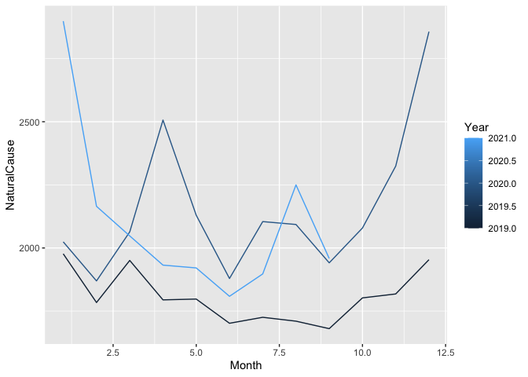

Leading Causes of Death in US
================
Yumeng Gao
2022-10-22

# Introduction

# Methods

# Preliminary Results

# Conclusion

-   Mortality comparison among 3 years (overall, by sex, by age, and by
    race)
-   Mortality comparison among different causes (adding proportions?)
-   The influence of Covid-19 causes (multiple & underlying)

> Exploratory Data Analysis

1.  Formulate a question
2.  Read in the data
3.  Check the dimensions and headers and footers of the data
4.  Take a closer look at some/all of the variables
5.  Validate with an external source
6.  Conduct some summary statistics to answer the initial question -
    Make exploratory graphs

### Prepare the library–\> DELETE?

``` r
library(data.table)
library(dplyr)
```

    ## 
    ## Attaching package: 'dplyr'

    ## The following objects are masked from 'package:data.table':
    ## 
    ##     between, first, last

    ## The following objects are masked from 'package:stats':
    ## 
    ##     filter, lag

    ## The following objects are masked from 'package:base':
    ## 
    ##     intersect, setdiff, setequal, union

``` r
library(dtplyr)
library(tidyverse)
```

    ## ── Attaching packages
    ## ───────────────────────────────────────
    ## tidyverse 1.3.2 ──

    ## ✔ ggplot2 3.3.6     ✔ purrr   0.3.4
    ## ✔ tibble  3.1.8     ✔ stringr 1.4.1
    ## ✔ tidyr   1.2.0     ✔ forcats 0.5.2
    ## ✔ readr   2.1.2     
    ## ── Conflicts ────────────────────────────────────────── tidyverse_conflicts() ──
    ## ✖ dplyr::between()   masks data.table::between()
    ## ✖ dplyr::filter()    masks stats::filter()
    ## ✖ dplyr::first()     masks data.table::first()
    ## ✖ dplyr::lag()       masks stats::lag()
    ## ✖ dplyr::last()      masks data.table::last()
    ## ✖ purrr::transpose() masks data.table::transpose()

``` r
library(R.utils)
```

    ## Loading required package: R.oo
    ## Loading required package: R.methodsS3
    ## R.methodsS3 v1.8.2 (2022-06-13 22:00:14 UTC) successfully loaded. See ?R.methodsS3 for help.
    ## R.oo v1.25.0 (2022-06-12 02:20:02 UTC) successfully loaded. See ?R.oo for help.
    ## 
    ## Attaching package: 'R.oo'
    ## 
    ## The following object is masked from 'package:R.methodsS3':
    ## 
    ##     throw
    ## 
    ## The following objects are masked from 'package:methods':
    ## 
    ##     getClasses, getMethods
    ## 
    ## The following objects are masked from 'package:base':
    ## 
    ##     attach, detach, load, save
    ## 
    ## R.utils v2.12.0 (2022-06-28 03:20:05 UTC) successfully loaded. See ?R.utils for help.
    ## 
    ## Attaching package: 'R.utils'
    ## 
    ## The following object is masked from 'package:tidyr':
    ## 
    ##     extract
    ## 
    ## The following object is masked from 'package:utils':
    ## 
    ##     timestamp
    ## 
    ## The following objects are masked from 'package:base':
    ## 
    ##     cat, commandArgs, getOption, isOpen, nullfile, parse, warnings

``` r
library(lubridate)
```

    ## 
    ## Attaching package: 'lubridate'
    ## 
    ## The following objects are masked from 'package:data.table':
    ## 
    ##     hour, isoweek, mday, minute, month, quarter, second, wday, week,
    ##     yday, year
    ## 
    ## The following objects are masked from 'package:base':
    ## 
    ##     date, intersect, setdiff, union

``` r
library(leaflet)
library(webshot)
library(cowplot)
```

    ## 
    ## Attaching package: 'cowplot'
    ## 
    ## The following object is masked from 'package:lubridate':
    ## 
    ##     stamp

### Download dataset from CDC’s website and read it in.

AH Monthly Provisional Counts of Deaths for Select Causes of Death by
Sex, Age, and Race and Hispanic Origin
(<https://data.cdc.gov/NCHS/AH-Monthly-Provisional-Counts-of-Deaths-for-Select/65mz-jvh5>)

Provisional counts of deaths by the month the deaths occurred, by age
group, sex, and race/ethnicity, for select underlying causes of death
for 2020-2021. Final data are provided for 2019. The dataset also
includes monthly provisional counts of death for COVID-19, as an
underlying or multiple cause of death.

``` r
if (!file.exists("deaths.csv")) {
  download.file(
    url = "https://data.cdc.gov/api/views/65mz-jvh5/rows.csv?accessType=DOWNLOAD", "deaths.csv", method = "libcurl", timeout  = 60)
}
ah= data.table::fread("deaths.csv")
```

``` r
dim(ah)
```

    ## [1] 3960   24

``` r
head(ah)
```

    ##    AnalysisDate Date Of Death Year Date Of Death Month Start Date   End Date
    ## 1:   10/13/2021               2019                   7 07/01/2019 07/31/2019
    ## 2:   10/13/2021               2019                   9 09/01/2019 09/30/2019
    ## 3:   10/13/2021               2020                   3 03/01/2020 03/31/2020
    ## 4:   10/13/2021               2020                   3 03/01/2020 03/31/2020
    ## 5:   10/13/2021               2020                   3 03/01/2020 03/31/2020
    ## 6:   10/13/2021               2021                   4 04/01/2021 04/30/2021
    ##    Jurisdiction of Occurrence    Sex Race/Ethnicity    AgeGroup AllCause
    ## 1:              United States      M          Other   0-4 years       61
    ## 2:              United States      F          Other 25-34 years       26
    ## 3:              United States Female          Other   0-4 years       40
    ## 4:              United States Female          Other  5-14 years        6
    ## 5:              United States Female          Other 15-24 years       14
    ## 6:              United States   Male          Other   0-4 years       49
    ##    NaturalCause Septicemia (A40-A41) Malignant neoplasms (C00-C97)
    ## 1:           52                    0                             1
    ## 2:            8                    0                             1
    ## 3:           35                    0                             0
    ## 4:            4                    1                             0
    ## 5:            2                    0                             0
    ## 6:           42                    0                             0
    ##    Diabetes mellitus (E10-E14) Alzheimer disease (G30)
    ## 1:                           0                       0
    ## 2:                           0                       0
    ## 3:                           0                       0
    ## 4:                           0                       0
    ## 5:                           0                       0
    ## 6:                           0                       0
    ##    Influenza and pneumonia (J09-J18)
    ## 1:                                 1
    ## 2:                                 0
    ## 3:                                 1
    ## 4:                                 1
    ## 5:                                 0
    ## 6:                                 0
    ##    Chronic lower respiratory diseases (J40-J47)
    ## 1:                                            0
    ## 2:                                            0
    ## 3:                                            0
    ## 4:                                            0
    ## 5:                                            0
    ## 6:                                            0
    ##    Other diseases of respiratory system (J00-J06,J30-J39,J67,J70-J98)
    ## 1:                                                                  1
    ## 2:                                                                  0
    ## 3:                                                                  0
    ## 4:                                                                  0
    ## 5:                                                                  0
    ## 6:                                                                  0
    ##    Nephritis, nephrotic syndrome and nephrosis (N00-N07,N17-N19,N25-N27)
    ## 1:                                                                     0
    ## 2:                                                                     0
    ## 3:                                                                     0
    ## 4:                                                                     0
    ## 5:                                                                     0
    ## 6:                                                                     0
    ##    Symptoms, signs and abnormal clinical and laboratory findings, not elsewhere classified (R00-R99)
    ## 1:                                                                                                 6
    ## 2:                                                                                                 0
    ## 3:                                                                                                 7
    ## 4:                                                                                                 0
    ## 5:                                                                                                 1
    ## 6:                                                                                                 6
    ##    Diseases of heart (I00-I09,I11,I13,I20-I51)
    ## 1:                                           0
    ## 2:                                           1
    ## 3:                                           0
    ## 4:                                           0
    ## 5:                                           0
    ## 6:                                           0
    ##    Cerebrovascular diseases (I60-I69) COVID-19 (U071, Multiple Cause of Death)
    ## 1:                                  1                                        0
    ## 2:                                  1                                        0
    ## 3:                                  0                                        0
    ## 4:                                  0                                        0
    ## 5:                                  0                                        0
    ## 6:                                  0                                        1
    ##    COVID-19 (U071, Underlying Cause of Death)
    ## 1:                                          0
    ## 2:                                          0
    ## 3:                                          0
    ## 4:                                          0
    ## 5:                                          0
    ## 6:                                          1

``` r
tail(ah)
```

    ##    AnalysisDate Date Of Death Year Date Of Death Month Start Date   End Date
    ## 1:   10/13/2021               2021                   9 09/01/2021 09/30/2021
    ## 2:   10/13/2021               2021                   9 09/01/2021 09/30/2021
    ## 3:   10/13/2021               2021                   9 09/01/2021 09/30/2021
    ## 4:   10/13/2021               2021                   9 09/01/2021 09/30/2021
    ## 5:   10/13/2021               2021                   9 09/01/2021 09/30/2021
    ## 6:   10/13/2021               2021                   9 09/01/2021 09/30/2021
    ##    Jurisdiction of Occurrence  Sex Race/Ethnicity          AgeGroup AllCause
    ## 1:              United States Male          Other       35-44 years      107
    ## 2:              United States Male          Other       45-54 years      179
    ## 3:              United States Male          Other       55-64 years      237
    ## 4:              United States Male          Other       65-74 years      263
    ## 5:              United States Male          Other       75-84 years      203
    ## 6:              United States Male          Other 85 years and over      116
    ##    NaturalCause Septicemia (A40-A41) Malignant neoplasms (C00-C97)
    ## 1:           95                    0                             6
    ## 2:          168                    1                            15
    ## 3:          225                    2                            34
    ## 4:          258                    2                            51
    ## 5:          200                    1                            35
    ## 6:          116                    3                            13
    ##    Diabetes mellitus (E10-E14) Alzheimer disease (G30)
    ## 1:                           2                       0
    ## 2:                           2                       1
    ## 3:                           7                       0
    ## 4:                          11                       3
    ## 5:                           9                       5
    ## 6:                           2                       7
    ##    Influenza and pneumonia (J09-J18)
    ## 1:                                 0
    ## 2:                                 1
    ## 3:                                 3
    ## 4:                                 4
    ## 5:                                 2
    ## 6:                                 1
    ##    Chronic lower respiratory diseases (J40-J47)
    ## 1:                                            0
    ## 2:                                            0
    ## 3:                                            8
    ## 4:                                            8
    ## 5:                                            6
    ## 6:                                            9
    ##    Other diseases of respiratory system (J00-J06,J30-J39,J67,J70-J98)
    ## 1:                                                                  0
    ## 2:                                                                  0
    ## 3:                                                                  3
    ## 4:                                                                  3
    ## 5:                                                                  4
    ## 6:                                                                  2
    ##    Nephritis, nephrotic syndrome and nephrosis (N00-N07,N17-N19,N25-N27)
    ## 1:                                                                     2
    ## 2:                                                                     2
    ## 3:                                                                     2
    ## 4:                                                                     4
    ## 5:                                                                     4
    ## 6:                                                                     1
    ##    Symptoms, signs and abnormal clinical and laboratory findings, not elsewhere classified (R00-R99)
    ## 1:                                                                                                33
    ## 2:                                                                                                34
    ## 3:                                                                                                36
    ## 4:                                                                                                25
    ## 5:                                                                                                17
    ## 6:                                                                                                 1
    ##    Diseases of heart (I00-I09,I11,I13,I20-I51)
    ## 1:                                           9
    ## 2:                                          18
    ## 3:                                          40
    ## 4:                                          60
    ## 5:                                          37
    ## 6:                                          23
    ##    Cerebrovascular diseases (I60-I69) COVID-19 (U071, Multiple Cause of Death)
    ## 1:                                  2                                       27
    ## 2:                                  2                                       70
    ## 3:                                  8                                       55
    ## 4:                                  7                                       55
    ## 5:                                  8                                       36
    ## 6:                                  7                                       18
    ##    COVID-19 (U071, Underlying Cause of Death)
    ## 1:                                         24
    ## 2:                                         68
    ## 3:                                         55
    ## 4:                                         49
    ## 5:                                         34
    ## 6:                                         18

4.  Check the variable types in the data

``` r
str(ah)
```

    ## Classes 'data.table' and 'data.frame':   3960 obs. of  24 variables:
    ##  $ AnalysisDate                                                                                     : chr  "10/13/2021" "10/13/2021" "10/13/2021" "10/13/2021" ...
    ##  $ Date Of Death Year                                                                               : int  2019 2019 2020 2020 2020 2021 2019 2019 2019 2019 ...
    ##  $ Date Of Death Month                                                                              : int  7 9 3 3 3 4 1 1 1 1 ...
    ##  $ Start Date                                                                                       : chr  "07/01/2019" "09/01/2019" "03/01/2020" "03/01/2020" ...
    ##  $ End Date                                                                                         : chr  "07/31/2019" "09/30/2019" "03/31/2020" "03/31/2020" ...
    ##  $ Jurisdiction of Occurrence                                                                       : chr  "United States" "United States" "United States" "United States" ...
    ##  $ Sex                                                                                              : chr  "M" "F" "Female" "Female" ...
    ##  $ Race/Ethnicity                                                                                   : chr  "Other" "Other" "Other" "Other" ...
    ##  $ AgeGroup                                                                                         : chr  "0-4 years" "25-34 years" "0-4 years" "5-14 years" ...
    ##  $ AllCause                                                                                         : int  61 26 40 6 14 49 182 44 122 198 ...
    ##  $ NaturalCause                                                                                     : int  52 8 35 4 2 42 162 28 45 100 ...
    ##  $ Septicemia (A40-A41)                                                                             : int  0 0 0 1 0 0 4 1 0 1 ...
    ##  $ Malignant neoplasms (C00-C97)                                                                    : int  1 1 0 0 0 0 2 8 7 29 ...
    ##  $ Diabetes mellitus (E10-E14)                                                                      : int  0 0 0 0 0 0 0 1 1 6 ...
    ##  $ Alzheimer disease (G30)                                                                          : int  0 0 0 0 0 0 0 0 0 0 ...
    ##  $ Influenza and pneumonia (J09-J18)                                                                : int  1 0 1 1 0 0 4 4 0 5 ...
    ##  $ Chronic lower respiratory diseases (J40-J47)                                                     : int  0 0 0 0 0 0 0 1 2 2 ...
    ##  $ Other diseases of respiratory system (J00-J06,J30-J39,J67,J70-J98)                               : int  1 0 0 0 0 0 1 0 1 3 ...
    ##  $ Nephritis, nephrotic syndrome and nephrosis (N00-N07,N17-N19,N25-N27)                            : int  0 0 0 0 0 0 0 0 2 0 ...
    ##  $ Symptoms, signs and abnormal clinical and laboratory findings, not elsewhere classified (R00-R99): int  6 0 7 0 1 6 22 0 4 2 ...
    ##  $ Diseases of heart (I00-I09,I11,I13,I20-I51)                                                      : int  0 1 0 0 0 0 1 0 6 8 ...
    ##  $ Cerebrovascular diseases (I60-I69)                                                               : int  1 1 0 0 0 0 0 0 1 2 ...
    ##  $ COVID-19 (U071, Multiple Cause of Death)                                                         : int  0 0 0 0 0 1 0 0 0 0 ...
    ##  $ COVID-19 (U071, Underlying Cause of Death)                                                       : int  0 0 0 0 0 1 0 0 0 0 ...
    ##  - attr(*, ".internal.selfref")=<externalptr>

Change the names of the key variables so that they are easier to refer
to in the code.

``` r
setnames(ah, old = c('Date Of Death Year', 'Date Of Death Month', 'Race/Ethnicity' ,'Septicemia (A40-A41)', 'Malignant neoplasms (C00-C97)', 'Diabetes mellitus (E10-E14)', 'Alzheimer disease (G30)', 'Influenza and pneumonia (J09-J18)', 'Chronic lower respiratory diseases (J40-J47)', 'Other diseases of respiratory system (J00-J06,J30-J39,J67,J70-J98)', 'Nephritis, nephrotic syndrome and nephrosis (N00-N07,N17-N19,N25-N27)','Symptoms, signs and abnormal clinical and laboratory findings, not elsewhere classified (R00-R99)', 'Diseases of heart (I00-I09,I11,I13,I20-I51)' ,'Cerebrovascular diseases (I60-I69)' ,'COVID-19 (U071, Multiple Cause of Death)' ,'COVID-19 (U071, Underlying Cause of Death)'), new = c('Year', 'Month', 'Race', 'Septicemia', 'Tumor', 'Diabetes', 'Alzheimer', 'Flu&Pneumonia', 'Lower_R','Other_R' ,'Nephrosis', 'Abnormal', 'Heart', 'Cerebrovascular', 'Covid_Multi' ,'Covid_Under'))
```

``` r
str(ah)
```

    ## Classes 'data.table' and 'data.frame':   3960 obs. of  24 variables:
    ##  $ AnalysisDate              : chr  "10/13/2021" "10/13/2021" "10/13/2021" "10/13/2021" ...
    ##  $ Year                      : int  2019 2019 2020 2020 2020 2021 2019 2019 2019 2019 ...
    ##  $ Month                     : int  7 9 3 3 3 4 1 1 1 1 ...
    ##  $ Start Date                : chr  "07/01/2019" "09/01/2019" "03/01/2020" "03/01/2020" ...
    ##  $ End Date                  : chr  "07/31/2019" "09/30/2019" "03/31/2020" "03/31/2020" ...
    ##  $ Jurisdiction of Occurrence: chr  "United States" "United States" "United States" "United States" ...
    ##  $ Sex                       : chr  "M" "F" "Female" "Female" ...
    ##  $ Race                      : chr  "Other" "Other" "Other" "Other" ...
    ##  $ AgeGroup                  : chr  "0-4 years" "25-34 years" "0-4 years" "5-14 years" ...
    ##  $ AllCause                  : int  61 26 40 6 14 49 182 44 122 198 ...
    ##  $ NaturalCause              : int  52 8 35 4 2 42 162 28 45 100 ...
    ##  $ Septicemia                : int  0 0 0 1 0 0 4 1 0 1 ...
    ##  $ Tumor                     : int  1 1 0 0 0 0 2 8 7 29 ...
    ##  $ Diabetes                  : int  0 0 0 0 0 0 0 1 1 6 ...
    ##  $ Alzheimer                 : int  0 0 0 0 0 0 0 0 0 0 ...
    ##  $ Flu&Pneumonia             : int  1 0 1 1 0 0 4 4 0 5 ...
    ##  $ Lower_R                   : int  0 0 0 0 0 0 0 1 2 2 ...
    ##  $ Other_R                   : int  1 0 0 0 0 0 1 0 1 3 ...
    ##  $ Nephrosis                 : int  0 0 0 0 0 0 0 0 2 0 ...
    ##  $ Abnormal                  : int  6 0 7 0 1 6 22 0 4 2 ...
    ##  $ Heart                     : int  0 1 0 0 0 0 1 0 6 8 ...
    ##  $ Cerebrovascular           : int  1 1 0 0 0 0 0 0 1 2 ...
    ##  $ Covid_Multi               : int  0 0 0 0 0 1 0 0 0 0 ...
    ##  $ Covid_Under               : int  0 0 0 0 0 1 0 0 0 0 ...
    ##  - attr(*, ".internal.selfref")=<externalptr>

Categorical Variables

``` r
ah$Y= as.character(ah$Year)
ah$M= as.character(ah$Month)
is.char= sapply(ah, is.character)
cate= ah[, ..is.char]
apply(cate, 2, table)
```

    ## $AnalysisDate
    ## 
    ## 10/13/2021 
    ##       3960 
    ## 
    ## $`Start Date`
    ## 
    ## 01/01/2019 01/01/2020 01/01/2021 02/01/2019 02/01/2020 02/01/2021 03/01/2019 
    ##        120        120        120        120        120        120        120 
    ## 03/01/2020 03/01/2021 04/01/2019 04/01/2020 04/01/2021 05/01/2019 05/01/2020 
    ##        120        120        120        120        120        120        120 
    ## 05/01/2021 06/01/2019 06/01/2020 06/01/2021 07/01/2019 07/01/2020 07/01/2021 
    ##        120        120        120        120        120        120        120 
    ## 08/01/2019 08/01/2020 08/01/2021 09/01/2019 09/01/2020 09/01/2021 10/01/2019 
    ##        120        120        120        120        120        120        120 
    ## 10/01/2020 11/01/2019 11/01/2020 12/01/2019 12/01/2020 
    ##        120        120        120        120        120 
    ## 
    ## $`End Date`
    ## 
    ## 01/31/2019 01/31/2020 01/31/2021 02/28/2019 02/28/2021 02/29/2020 03/31/2019 
    ##        120        120        120        120        120        120        120 
    ## 03/31/2020 03/31/2021 04/30/2019 04/30/2020 04/30/2021 05/31/2019 05/31/2020 
    ##        120        120        120        120        120        120        120 
    ## 05/31/2021 06/30/2019 06/30/2020 06/30/2021 07/31/2019 07/31/2020 07/31/2021 
    ##        120        120        120        120        120        120        120 
    ## 08/31/2019 08/31/2020 08/31/2021 09/30/2019 09/30/2020 09/30/2021 10/31/2019 
    ##        120        120        120        120        120        120        120 
    ## 10/31/2020 11/30/2019 11/30/2020 12/31/2019 12/31/2020 
    ##        120        120        120        120        120 
    ## 
    ## $`Jurisdiction of Occurrence`
    ## 
    ## United States 
    ##          3960 
    ## 
    ## $Sex
    ## 
    ##      F Female      M   Male 
    ##    720   1260    720   1260 
    ## 
    ## $Race
    ## 
    ##                                      Hispanic 
    ##                                           660 
    ## Non-Hispanic American Indian or Alaska Native 
    ##                                           660 
    ##                            Non-Hispanic Asian 
    ##                                           660 
    ##                            Non-Hispanic Black 
    ##                                           660 
    ##                            Non-Hispanic White 
    ##                                           660 
    ##                                         Other 
    ##                                           660 
    ## 
    ## $AgeGroup
    ## 
    ##         0-4 years       15-24 years       25-34 years       35-44 years 
    ##               396               396               396               396 
    ##       45-54 years        5-14 years       55-64 years       65-74 years 
    ##               396               396               396               396 
    ##       75-84 years 85 years and over 
    ##               396               396 
    ## 
    ## $Y
    ## 
    ## 2019 2020 2021 
    ## 1440 1440 1080 
    ## 
    ## $M
    ## 
    ##   1  10  11  12   2   3   4   5   6   7   8   9 
    ## 360 240 240 240 360 360 360 360 360 360 360 360

Fix Sex’s problem.

``` r
ah= tibble::rowid_to_column(ah, "ID")

for (i in 1:length(ah$ID)){
  if (ah$Sex[i]== 'Female'){
    ah$Sex[i]= 'F'
  } else if (ah$Sex[i]== 'Male'){
    ah$Sex[i]= 'M'}
}

table(ah$Sex)
```

    ## 
    ##    F    M 
    ## 1980 1980

Numerical Variables

``` r
summary(ah[,11:25])
```

    ##     AllCause      NaturalCause     Septicemia         Tumor       
    ##  Min.   :    0   Min.   :    0   Min.   :  0.00   Min.   :   0.0  
    ##  1st Qu.:   73   1st Qu.:   45   1st Qu.:  0.00   1st Qu.:   5.0  
    ##  Median :  247   Median :  187   Median :  2.00   Median :  30.0  
    ##  Mean   : 2198   Mean   : 2013   Mean   : 27.07   Mean   : 414.0  
    ##  3rd Qu.: 1424   3rd Qu.: 1111   3rd Qu.: 15.00   3rd Qu.: 212.2  
    ##  Max.   :55227   Max.   :53946   Max.   :484.00   Max.   :6541.0  
    ##     Diabetes         Alzheimer       Flu&Pneumonia        Lower_R      
    ##  Min.   :   0.00   Min.   :   0.00   Min.   :   0.00   Min.   :   0.0  
    ##  1st Qu.:   0.00   1st Qu.:   0.00   1st Qu.:   0.00   1st Qu.:   0.0  
    ##  Median :   8.00   Median :   0.00   Median :   3.00   Median :   4.0  
    ##  Mean   :  66.22   Mean   :  86.25   Mean   :  33.35   Mean   : 103.6  
    ##  3rd Qu.:  50.00   3rd Qu.:   6.00   3rd Qu.:  19.00   3rd Qu.:  22.0  
    ##  Max.   :1039.00   Max.   :4844.00   Max.   :1216.00   Max.   :2408.0  
    ##     Other_R         Nephrosis         Abnormal           Heart        
    ##  Min.   :  0.00   Min.   :  0.00   Min.   :   0.00   Min.   :    0.0  
    ##  1st Qu.:  0.00   1st Qu.:  0.00   1st Qu.:   1.00   1st Qu.:    3.0  
    ##  Median :  2.00   Median :  3.00   Median :   5.00   Median :   29.0  
    ##  Mean   : 30.75   Mean   : 36.04   Mean   :  33.06   Mean   :  465.9  
    ##  3rd Qu.: 14.00   3rd Qu.: 20.00   3rd Qu.:  22.25   3rd Qu.:  212.0  
    ##  Max.   :665.00   Max.   :651.00   Max.   :1308.00   Max.   :11502.0  
    ##  Cerebrovascular   Covid_Multi       Covid_Under     
    ##  Min.   :   0.0   Min.   :    0.0   Min.   :    0.0  
    ##  1st Qu.:   1.0   1st Qu.:    0.0   1st Qu.:    0.0  
    ##  Median :   6.0   Median :    0.0   Median :    0.0  
    ##  Mean   : 107.7   Mean   :  179.2   Mean   :  162.5  
    ##  3rd Qu.:  56.0   3rd Qu.:   37.0   3rd Qu.:   33.0  
    ##  Max.   :3483.0   Max.   :15441.0   Max.   :13510.0

``` r
avg_m= as.data.table(group_by(ah, Year, Month) %>% summarize( AllCause= mean(AllCause), NaturalCause= mean(NaturalCause), Septicemia= mean(Septicemia),Tumor= mean(Tumor)))
```

    ## `summarise()` has grouped output by 'Year'. You can override using the `.groups`
    ## argument.

``` r
ggplot(data = avg_m)+
 geom_line(mapping=aes(x= Month, y= NaturalCause, group= Year, color= Year))
```

<!-- -->
