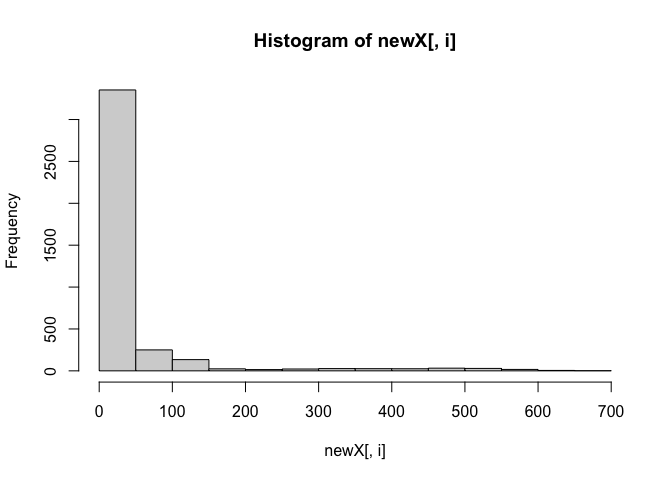

Important Causes of Death in US
================
Yumeng Gao
2022-10-19

# Introduction

# Methods

# Preliminary Results

# Conclusion

> Exploratory Data Analysis

1.  Formulate a question
2.  Read in the data
3.  Check the dimensions and headers and footers of the data
4.  Take a closer look at some/all of the variables
5.  Validate with an external source
6.  Conduct some summary statistics to answer the initial question -
    Make exploratory graphs

### Prepare the library–\> DELETE?

``` r
library(data.table)
library(dplyr)
```

    ## 
    ## Attaching package: 'dplyr'

    ## The following objects are masked from 'package:data.table':
    ## 
    ##     between, first, last

    ## The following objects are masked from 'package:stats':
    ## 
    ##     filter, lag

    ## The following objects are masked from 'package:base':
    ## 
    ##     intersect, setdiff, setequal, union

``` r
library(dtplyr)
library(tidyverse)
```

    ## ── Attaching packages
    ## ───────────────────────────────────────
    ## tidyverse 1.3.2 ──

    ## ✔ ggplot2 3.3.6     ✔ purrr   0.3.4
    ## ✔ tibble  3.1.8     ✔ stringr 1.4.1
    ## ✔ tidyr   1.2.0     ✔ forcats 0.5.2
    ## ✔ readr   2.1.2     
    ## ── Conflicts ────────────────────────────────────────── tidyverse_conflicts() ──
    ## ✖ dplyr::between()   masks data.table::between()
    ## ✖ dplyr::filter()    masks stats::filter()
    ## ✖ dplyr::first()     masks data.table::first()
    ## ✖ dplyr::lag()       masks stats::lag()
    ## ✖ dplyr::last()      masks data.table::last()
    ## ✖ purrr::transpose() masks data.table::transpose()

``` r
library(R.utils)
```

    ## Loading required package: R.oo
    ## Loading required package: R.methodsS3
    ## R.methodsS3 v1.8.2 (2022-06-13 22:00:14 UTC) successfully loaded. See ?R.methodsS3 for help.
    ## R.oo v1.25.0 (2022-06-12 02:20:02 UTC) successfully loaded. See ?R.oo for help.
    ## 
    ## Attaching package: 'R.oo'
    ## 
    ## The following object is masked from 'package:R.methodsS3':
    ## 
    ##     throw
    ## 
    ## The following objects are masked from 'package:methods':
    ## 
    ##     getClasses, getMethods
    ## 
    ## The following objects are masked from 'package:base':
    ## 
    ##     attach, detach, load, save
    ## 
    ## R.utils v2.12.0 (2022-06-28 03:20:05 UTC) successfully loaded. See ?R.utils for help.
    ## 
    ## Attaching package: 'R.utils'
    ## 
    ## The following object is masked from 'package:tidyr':
    ## 
    ##     extract
    ## 
    ## The following object is masked from 'package:utils':
    ## 
    ##     timestamp
    ## 
    ## The following objects are masked from 'package:base':
    ## 
    ##     cat, commandArgs, getOption, isOpen, nullfile, parse, warnings

``` r
library(lubridate)
```

    ## 
    ## Attaching package: 'lubridate'
    ## 
    ## The following objects are masked from 'package:data.table':
    ## 
    ##     hour, isoweek, mday, minute, month, quarter, second, wday, week,
    ##     yday, year
    ## 
    ## The following objects are masked from 'package:base':
    ## 
    ##     date, intersect, setdiff, union

``` r
library(leaflet)
library(webshot)
library(cowplot)
```

    ## 
    ## Attaching package: 'cowplot'
    ## 
    ## The following object is masked from 'package:lubridate':
    ## 
    ##     stamp

### Download dataset from CDC’s website and read it in.

AH Monthly Provisional Counts of Deaths for Select Causes of Death by
Sex, Age, and Race and Hispanic Origin
(<https://data.cdc.gov/NCHS/AH-Monthly-Provisional-Counts-of-Deaths-for-Select/65mz-jvh5>)

Provisional counts of deaths by the month the deaths occurred, by age
group, sex, and race/ethnicity, for select underlying causes of death
for 2020-2021. Final data are provided for 2019. The dataset also
includes monthly provisional counts of death for COVID-19, coded to
ICD-10 code U07.1 as an underlying or multiple cause of death.

``` r
if (!file.exists("deaths.csv")) {
  download.file(
    url = "https://data.cdc.gov/api/views/65mz-jvh5/rows.csv?accessType=DOWNLOAD", "deaths.csv", method = "libcurl", timeout  = 60)
}
ah= data.table::fread("deaths.csv")
```

``` r
dim(ah)
```

    ## [1] 3960   24

``` r
head(ah)
```

    ##    AnalysisDate Date Of Death Year Date Of Death Month Start Date   End Date
    ## 1:   10/13/2021               2019                   7 07/01/2019 07/31/2019
    ## 2:   10/13/2021               2019                   9 09/01/2019 09/30/2019
    ## 3:   10/13/2021               2020                   3 03/01/2020 03/31/2020
    ## 4:   10/13/2021               2020                   3 03/01/2020 03/31/2020
    ## 5:   10/13/2021               2020                   3 03/01/2020 03/31/2020
    ## 6:   10/13/2021               2021                   4 04/01/2021 04/30/2021
    ##    Jurisdiction of Occurrence    Sex Race/Ethnicity    AgeGroup AllCause
    ## 1:              United States      M          Other   0-4 years       61
    ## 2:              United States      F          Other 25-34 years       26
    ## 3:              United States Female          Other   0-4 years       40
    ## 4:              United States Female          Other  5-14 years        6
    ## 5:              United States Female          Other 15-24 years       14
    ## 6:              United States   Male          Other   0-4 years       49
    ##    NaturalCause Septicemia (A40-A41) Malignant neoplasms (C00-C97)
    ## 1:           52                    0                             1
    ## 2:            8                    0                             1
    ## 3:           35                    0                             0
    ## 4:            4                    1                             0
    ## 5:            2                    0                             0
    ## 6:           42                    0                             0
    ##    Diabetes mellitus (E10-E14) Alzheimer disease (G30)
    ## 1:                           0                       0
    ## 2:                           0                       0
    ## 3:                           0                       0
    ## 4:                           0                       0
    ## 5:                           0                       0
    ## 6:                           0                       0
    ##    Influenza and pneumonia (J09-J18)
    ## 1:                                 1
    ## 2:                                 0
    ## 3:                                 1
    ## 4:                                 1
    ## 5:                                 0
    ## 6:                                 0
    ##    Chronic lower respiratory diseases (J40-J47)
    ## 1:                                            0
    ## 2:                                            0
    ## 3:                                            0
    ## 4:                                            0
    ## 5:                                            0
    ## 6:                                            0
    ##    Other diseases of respiratory system (J00-J06,J30-J39,J67,J70-J98)
    ## 1:                                                                  1
    ## 2:                                                                  0
    ## 3:                                                                  0
    ## 4:                                                                  0
    ## 5:                                                                  0
    ## 6:                                                                  0
    ##    Nephritis, nephrotic syndrome and nephrosis (N00-N07,N17-N19,N25-N27)
    ## 1:                                                                     0
    ## 2:                                                                     0
    ## 3:                                                                     0
    ## 4:                                                                     0
    ## 5:                                                                     0
    ## 6:                                                                     0
    ##    Symptoms, signs and abnormal clinical and laboratory findings, not elsewhere classified (R00-R99)
    ## 1:                                                                                                 6
    ## 2:                                                                                                 0
    ## 3:                                                                                                 7
    ## 4:                                                                                                 0
    ## 5:                                                                                                 1
    ## 6:                                                                                                 6
    ##    Diseases of heart (I00-I09,I11,I13,I20-I51)
    ## 1:                                           0
    ## 2:                                           1
    ## 3:                                           0
    ## 4:                                           0
    ## 5:                                           0
    ## 6:                                           0
    ##    Cerebrovascular diseases (I60-I69) COVID-19 (U071, Multiple Cause of Death)
    ## 1:                                  1                                        0
    ## 2:                                  1                                        0
    ## 3:                                  0                                        0
    ## 4:                                  0                                        0
    ## 5:                                  0                                        0
    ## 6:                                  0                                        1
    ##    COVID-19 (U071, Underlying Cause of Death)
    ## 1:                                          0
    ## 2:                                          0
    ## 3:                                          0
    ## 4:                                          0
    ## 5:                                          0
    ## 6:                                          1

``` r
tail(ah)
```

    ##    AnalysisDate Date Of Death Year Date Of Death Month Start Date   End Date
    ## 1:   10/13/2021               2021                   9 09/01/2021 09/30/2021
    ## 2:   10/13/2021               2021                   9 09/01/2021 09/30/2021
    ## 3:   10/13/2021               2021                   9 09/01/2021 09/30/2021
    ## 4:   10/13/2021               2021                   9 09/01/2021 09/30/2021
    ## 5:   10/13/2021               2021                   9 09/01/2021 09/30/2021
    ## 6:   10/13/2021               2021                   9 09/01/2021 09/30/2021
    ##    Jurisdiction of Occurrence  Sex Race/Ethnicity          AgeGroup AllCause
    ## 1:              United States Male          Other       35-44 years      107
    ## 2:              United States Male          Other       45-54 years      179
    ## 3:              United States Male          Other       55-64 years      237
    ## 4:              United States Male          Other       65-74 years      263
    ## 5:              United States Male          Other       75-84 years      203
    ## 6:              United States Male          Other 85 years and over      116
    ##    NaturalCause Septicemia (A40-A41) Malignant neoplasms (C00-C97)
    ## 1:           95                    0                             6
    ## 2:          168                    1                            15
    ## 3:          225                    2                            34
    ## 4:          258                    2                            51
    ## 5:          200                    1                            35
    ## 6:          116                    3                            13
    ##    Diabetes mellitus (E10-E14) Alzheimer disease (G30)
    ## 1:                           2                       0
    ## 2:                           2                       1
    ## 3:                           7                       0
    ## 4:                          11                       3
    ## 5:                           9                       5
    ## 6:                           2                       7
    ##    Influenza and pneumonia (J09-J18)
    ## 1:                                 0
    ## 2:                                 1
    ## 3:                                 3
    ## 4:                                 4
    ## 5:                                 2
    ## 6:                                 1
    ##    Chronic lower respiratory diseases (J40-J47)
    ## 1:                                            0
    ## 2:                                            0
    ## 3:                                            8
    ## 4:                                            8
    ## 5:                                            6
    ## 6:                                            9
    ##    Other diseases of respiratory system (J00-J06,J30-J39,J67,J70-J98)
    ## 1:                                                                  0
    ## 2:                                                                  0
    ## 3:                                                                  3
    ## 4:                                                                  3
    ## 5:                                                                  4
    ## 6:                                                                  2
    ##    Nephritis, nephrotic syndrome and nephrosis (N00-N07,N17-N19,N25-N27)
    ## 1:                                                                     2
    ## 2:                                                                     2
    ## 3:                                                                     2
    ## 4:                                                                     4
    ## 5:                                                                     4
    ## 6:                                                                     1
    ##    Symptoms, signs and abnormal clinical and laboratory findings, not elsewhere classified (R00-R99)
    ## 1:                                                                                                33
    ## 2:                                                                                                34
    ## 3:                                                                                                36
    ## 4:                                                                                                25
    ## 5:                                                                                                17
    ## 6:                                                                                                 1
    ##    Diseases of heart (I00-I09,I11,I13,I20-I51)
    ## 1:                                           9
    ## 2:                                          18
    ## 3:                                          40
    ## 4:                                          60
    ## 5:                                          37
    ## 6:                                          23
    ##    Cerebrovascular diseases (I60-I69) COVID-19 (U071, Multiple Cause of Death)
    ## 1:                                  2                                       27
    ## 2:                                  2                                       70
    ## 3:                                  8                                       55
    ## 4:                                  7                                       55
    ## 5:                                  8                                       36
    ## 6:                                  7                                       18
    ##    COVID-19 (U071, Underlying Cause of Death)
    ## 1:                                         24
    ## 2:                                         68
    ## 3:                                         55
    ## 4:                                         49
    ## 5:                                         34
    ## 6:                                         18

4.  Check the variable types in the data

``` r
str(ah)
```

    ## Classes 'data.table' and 'data.frame':   3960 obs. of  24 variables:
    ##  $ AnalysisDate                                                                                     : chr  "10/13/2021" "10/13/2021" "10/13/2021" "10/13/2021" ...
    ##  $ Date Of Death Year                                                                               : int  2019 2019 2020 2020 2020 2021 2019 2019 2019 2019 ...
    ##  $ Date Of Death Month                                                                              : int  7 9 3 3 3 4 1 1 1 1 ...
    ##  $ Start Date                                                                                       : chr  "07/01/2019" "09/01/2019" "03/01/2020" "03/01/2020" ...
    ##  $ End Date                                                                                         : chr  "07/31/2019" "09/30/2019" "03/31/2020" "03/31/2020" ...
    ##  $ Jurisdiction of Occurrence                                                                       : chr  "United States" "United States" "United States" "United States" ...
    ##  $ Sex                                                                                              : chr  "M" "F" "Female" "Female" ...
    ##  $ Race/Ethnicity                                                                                   : chr  "Other" "Other" "Other" "Other" ...
    ##  $ AgeGroup                                                                                         : chr  "0-4 years" "25-34 years" "0-4 years" "5-14 years" ...
    ##  $ AllCause                                                                                         : int  61 26 40 6 14 49 182 44 122 198 ...
    ##  $ NaturalCause                                                                                     : int  52 8 35 4 2 42 162 28 45 100 ...
    ##  $ Septicemia (A40-A41)                                                                             : int  0 0 0 1 0 0 4 1 0 1 ...
    ##  $ Malignant neoplasms (C00-C97)                                                                    : int  1 1 0 0 0 0 2 8 7 29 ...
    ##  $ Diabetes mellitus (E10-E14)                                                                      : int  0 0 0 0 0 0 0 1 1 6 ...
    ##  $ Alzheimer disease (G30)                                                                          : int  0 0 0 0 0 0 0 0 0 0 ...
    ##  $ Influenza and pneumonia (J09-J18)                                                                : int  1 0 1 1 0 0 4 4 0 5 ...
    ##  $ Chronic lower respiratory diseases (J40-J47)                                                     : int  0 0 0 0 0 0 0 1 2 2 ...
    ##  $ Other diseases of respiratory system (J00-J06,J30-J39,J67,J70-J98)                               : int  1 0 0 0 0 0 1 0 1 3 ...
    ##  $ Nephritis, nephrotic syndrome and nephrosis (N00-N07,N17-N19,N25-N27)                            : int  0 0 0 0 0 0 0 0 2 0 ...
    ##  $ Symptoms, signs and abnormal clinical and laboratory findings, not elsewhere classified (R00-R99): int  6 0 7 0 1 6 22 0 4 2 ...
    ##  $ Diseases of heart (I00-I09,I11,I13,I20-I51)                                                      : int  0 1 0 0 0 0 1 0 6 8 ...
    ##  $ Cerebrovascular diseases (I60-I69)                                                               : int  1 1 0 0 0 0 0 0 1 2 ...
    ##  $ COVID-19 (U071, Multiple Cause of Death)                                                         : int  0 0 0 0 0 1 0 0 0 0 ...
    ##  $ COVID-19 (U071, Underlying Cause of Death)                                                       : int  0 0 0 0 0 1 0 0 0 0 ...
    ##  - attr(*, ".internal.selfref")=<externalptr>

Change the names of the key variables so that they are easier to refer
to in your code.

``` r
setnames(ah, old = c('Date Of Death Year', 'Date Of Death Month', 'Race/Ethnicity' ,'Septicemia (A40-A41)', 'Malignant neoplasms (C00-C97)', 'Diabetes mellitus (E10-E14)', 'Alzheimer disease (G30)', 'Influenza and pneumonia (J09-J18)', 'Chronic lower respiratory diseases (J40-J47)', 'Other diseases of respiratory system (J00-J06,J30-J39,J67,J70-J98)', 'Nephritis, nephrotic syndrome and nephrosis (N00-N07,N17-N19,N25-N27)','Symptoms, signs and abnormal clinical and laboratory findings, not elsewhere classified (R00-R99)', 'Diseases of heart (I00-I09,I11,I13,I20-I51)' ,'Cerebrovascular diseases (I60-I69)' ,'COVID-19 (U071, Multiple Cause of Death)' ,'COVID-19 (U071, Underlying Cause of Death)'), new = c('Year', 'Month', 'Race', 'Septicemia', 'Tumor', 'Diabetes', 'Alzheimer', 'Flu&Pneumonia', 'Lower_R','Other_R' ,'Nephrosis', 'Abnormal', 'Heart', 'Cerebrovascular', 'Covid_Multi' ,'Covid_Under'))
```

``` r
str(ah)
```

    ## Classes 'data.table' and 'data.frame':   3960 obs. of  24 variables:
    ##  $ AnalysisDate              : chr  "10/13/2021" "10/13/2021" "10/13/2021" "10/13/2021" ...
    ##  $ Year                      : int  2019 2019 2020 2020 2020 2021 2019 2019 2019 2019 ...
    ##  $ Month                     : int  7 9 3 3 3 4 1 1 1 1 ...
    ##  $ Start Date                : chr  "07/01/2019" "09/01/2019" "03/01/2020" "03/01/2020" ...
    ##  $ End Date                  : chr  "07/31/2019" "09/30/2019" "03/31/2020" "03/31/2020" ...
    ##  $ Jurisdiction of Occurrence: chr  "United States" "United States" "United States" "United States" ...
    ##  $ Sex                       : chr  "M" "F" "Female" "Female" ...
    ##  $ Race                      : chr  "Other" "Other" "Other" "Other" ...
    ##  $ AgeGroup                  : chr  "0-4 years" "25-34 years" "0-4 years" "5-14 years" ...
    ##  $ AllCause                  : int  61 26 40 6 14 49 182 44 122 198 ...
    ##  $ NaturalCause              : int  52 8 35 4 2 42 162 28 45 100 ...
    ##  $ Septicemia                : int  0 0 0 1 0 0 4 1 0 1 ...
    ##  $ Tumor                     : int  1 1 0 0 0 0 2 8 7 29 ...
    ##  $ Diabetes                  : int  0 0 0 0 0 0 0 1 1 6 ...
    ##  $ Alzheimer                 : int  0 0 0 0 0 0 0 0 0 0 ...
    ##  $ Flu&Pneumonia             : int  1 0 1 1 0 0 4 4 0 5 ...
    ##  $ Lower_R                   : int  0 0 0 0 0 0 0 1 2 2 ...
    ##  $ Other_R                   : int  1 0 0 0 0 0 1 0 1 3 ...
    ##  $ Nephrosis                 : int  0 0 0 0 0 0 0 0 2 0 ...
    ##  $ Abnormal                  : int  6 0 7 0 1 6 22 0 4 2 ...
    ##  $ Heart                     : int  0 1 0 0 0 0 1 0 6 8 ...
    ##  $ Cerebrovascular           : int  1 1 0 0 0 0 0 0 1 2 ...
    ##  $ Covid_Multi               : int  0 0 0 0 0 1 0 0 0 0 ...
    ##  $ Covid_Under               : int  0 0 0 0 0 1 0 0 0 0 ...
    ##  - attr(*, ".internal.selfref")=<externalptr>

Categorical Variables

``` r
ah$Year= as.character(ah$Year)
ah$Month= as.character(ah$Month)
is.char= sapply(ah, is.character)
cate= ah[, ..is.char]
apply(cate, 2, table)
```

    ## $AnalysisDate
    ## 
    ## 10/13/2021 
    ##       3960 
    ## 
    ## $Year
    ## 
    ## 2019 2020 2021 
    ## 1440 1440 1080 
    ## 
    ## $Month
    ## 
    ##   1  10  11  12   2   3   4   5   6   7   8   9 
    ## 360 240 240 240 360 360 360 360 360 360 360 360 
    ## 
    ## $`Start Date`
    ## 
    ## 01/01/2019 01/01/2020 01/01/2021 02/01/2019 02/01/2020 02/01/2021 03/01/2019 
    ##        120        120        120        120        120        120        120 
    ## 03/01/2020 03/01/2021 04/01/2019 04/01/2020 04/01/2021 05/01/2019 05/01/2020 
    ##        120        120        120        120        120        120        120 
    ## 05/01/2021 06/01/2019 06/01/2020 06/01/2021 07/01/2019 07/01/2020 07/01/2021 
    ##        120        120        120        120        120        120        120 
    ## 08/01/2019 08/01/2020 08/01/2021 09/01/2019 09/01/2020 09/01/2021 10/01/2019 
    ##        120        120        120        120        120        120        120 
    ## 10/01/2020 11/01/2019 11/01/2020 12/01/2019 12/01/2020 
    ##        120        120        120        120        120 
    ## 
    ## $`End Date`
    ## 
    ## 01/31/2019 01/31/2020 01/31/2021 02/28/2019 02/28/2021 02/29/2020 03/31/2019 
    ##        120        120        120        120        120        120        120 
    ## 03/31/2020 03/31/2021 04/30/2019 04/30/2020 04/30/2021 05/31/2019 05/31/2020 
    ##        120        120        120        120        120        120        120 
    ## 05/31/2021 06/30/2019 06/30/2020 06/30/2021 07/31/2019 07/31/2020 07/31/2021 
    ##        120        120        120        120        120        120        120 
    ## 08/31/2019 08/31/2020 08/31/2021 09/30/2019 09/30/2020 09/30/2021 10/31/2019 
    ##        120        120        120        120        120        120        120 
    ## 10/31/2020 11/30/2019 11/30/2020 12/31/2019 12/31/2020 
    ##        120        120        120        120        120 
    ## 
    ## $`Jurisdiction of Occurrence`
    ## 
    ## United States 
    ##          3960 
    ## 
    ## $Sex
    ## 
    ##      F Female      M   Male 
    ##    720   1260    720   1260 
    ## 
    ## $Race
    ## 
    ##                                      Hispanic 
    ##                                           660 
    ## Non-Hispanic American Indian or Alaska Native 
    ##                                           660 
    ##                            Non-Hispanic Asian 
    ##                                           660 
    ##                            Non-Hispanic Black 
    ##                                           660 
    ##                            Non-Hispanic White 
    ##                                           660 
    ##                                         Other 
    ##                                           660 
    ## 
    ## $AgeGroup
    ## 
    ##         0-4 years       15-24 years       25-34 years       35-44 years 
    ##               396               396               396               396 
    ##       45-54 years        5-14 years       55-64 years       65-74 years 
    ##               396               396               396               396 
    ##       75-84 years 85 years and over 
    ##               396               396

Fix sex’s problem.

``` r
ah= tibble::rowid_to_column(ah, "ID")
for (i in 1:length(ah$ID)){
  if (ah$Sex[i]== 'Female'){
    ah$Sex[i]= 'F'
  } else if (ah$Sex[i]== 'Male'){
    ah$Sex[i]= 'M'}
}
table(ah$Sex)
```

    ## 
    ##    F    M 
    ## 1980 1980

Numerical Variables

``` r
is.inte= sapply(ah, is.integer)
inte= ah[, ..is.inte]
apply(inte, 2, summary)
```

    ##              ID  AllCause NaturalCause Septicemia     Tumor   Diabetes
    ## Min.       1.00     0.000        0.000    0.00000    0.0000    0.00000
    ## 1st Qu.  990.75    73.000       45.000    0.00000    5.0000    0.00000
    ## Median  1980.50   247.000      187.000    2.00000   30.0000    8.00000
    ## Mean    1980.50  2198.036     2013.428   27.07374  413.9745   66.22273
    ## 3rd Qu. 2970.25  1423.500     1111.000   15.00000  212.2500   50.00000
    ## Max.    3960.00 55227.000    53946.000  484.00000 6541.0000 1039.00000
    ##          Alzheimer Flu&Pneumonia   Lower_R   Other_R Nephrosis   Abnormal
    ## Min.       0.00000       0.00000    0.0000   0.00000   0.00000    0.00000
    ## 1st Qu.    0.00000       0.00000    0.0000   0.00000   0.00000    1.00000
    ## Median     0.00000       3.00000    4.0000   2.00000   3.00000    5.00000
    ## Mean      86.24571      33.34848  103.5874  30.74773  36.04242   33.06465
    ## 3rd Qu.    6.00000      19.00000   22.0000  14.00000  20.00000   22.25000
    ## Max.    4844.00000    1216.00000 2408.0000 665.00000 651.00000 1308.00000
    ##              Heart Cerebrovascular Covid_Multi Covid_Under
    ## Min.        0.0000          0.0000      0.0000      0.0000
    ## 1st Qu.     3.0000          1.0000      0.0000      0.0000
    ## Median     29.0000          6.0000      0.0000      0.0000
    ## Mean      465.9268        107.7025    179.1823    162.4818
    ## 3rd Qu.   212.0000         56.0000     37.0000     33.0000
    ## Max.    11502.0000       3483.0000  15441.0000  13510.0000

By year of death?

``` r
apply(inte, 2, hist)
```

<!-- --><!-- --><!-- --><!-- --><!-- --><!-- --><!-- --><!-- --><!-- --><!-- --><!-- --><!-- --><!-- --><!-- --><!-- --><!-- -->

    ## $ID
    ## $breaks
    ## [1]    0  500 1000 1500 2000 2500 3000 3500 4000
    ## 
    ## $counts
    ## [1] 500 500 500 500 500 500 500 460
    ## 
    ## $density
    ## [1] 0.0002525253 0.0002525253 0.0002525253 0.0002525253 0.0002525253
    ## [6] 0.0002525253 0.0002525253 0.0002323232
    ## 
    ## $mids
    ## [1]  250  750 1250 1750 2250 2750 3250 3750
    ## 
    ## $xname
    ## [1] "newX[, i]"
    ## 
    ## $equidist
    ## [1] TRUE
    ## 
    ## attr(,"class")
    ## [1] "histogram"
    ## 
    ## $AllCause
    ## $breaks
    ##  [1]     0  5000 10000 15000 20000 25000 30000 35000 40000 45000 50000 55000
    ## [13] 60000
    ## 
    ## $counts
    ##  [1] 3648   78   40   33   87   30   15   18    7    2    1    1
    ## 
    ## $density
    ##  [1] 1.842424e-04 3.939394e-06 2.020202e-06 1.666667e-06 4.393939e-06
    ##  [6] 1.515152e-06 7.575758e-07 9.090909e-07 3.535354e-07 1.010101e-07
    ## [11] 5.050505e-08 5.050505e-08
    ## 
    ## $mids
    ##  [1]  2500  7500 12500 17500 22500 27500 32500 37500 42500 47500 52500 57500
    ## 
    ## $xname
    ## [1] "newX[, i]"
    ## 
    ## $equidist
    ## [1] TRUE
    ## 
    ## attr(,"class")
    ## [1] "histogram"
    ## 
    ## $NaturalCause
    ## $breaks
    ##  [1]     0  5000 10000 15000 20000 25000 30000 35000 40000 45000 50000 55000
    ## 
    ## $counts
    ##  [1] 3680   46   45   34   92   21   15   20    4    1    2
    ## 
    ## $density
    ##  [1] 1.858586e-04 2.323232e-06 2.272727e-06 1.717172e-06 4.646465e-06
    ##  [6] 1.060606e-06 7.575758e-07 1.010101e-06 2.020202e-07 5.050505e-08
    ## [11] 1.010101e-07
    ## 
    ## $mids
    ##  [1]  2500  7500 12500 17500 22500 27500 32500 37500 42500 47500 52500
    ## 
    ## $xname
    ## [1] "newX[, i]"
    ## 
    ## $equidist
    ## [1] TRUE
    ## 
    ## attr(,"class")
    ## [1] "histogram"
    ## 
    ## $Septicemia
    ## $breaks
    ##  [1]   0  50 100 150 200 250 300 350 400 450 500
    ## 
    ## $counts
    ##  [1] 3451  245   19   45   23   77   68   24    6    2
    ## 
    ## $density
    ##  [1] 1.742929e-02 1.237374e-03 9.595960e-05 2.272727e-04 1.161616e-04
    ##  [6] 3.888889e-04 3.434343e-04 1.212121e-04 3.030303e-05 1.010101e-05
    ## 
    ## $mids
    ##  [1]  25  75 125 175 225 275 325 375 425 475
    ## 
    ## $xname
    ## [1] "newX[, i]"
    ## 
    ## $equidist
    ## [1] TRUE
    ## 
    ## attr(,"class")
    ## [1] "histogram"
    ## 
    ## $Tumor
    ## $breaks
    ##  [1]    0  500 1000 1500 2000 2500 3000 3500 4000 4500 5000 5500 6000 6500 7000
    ## 
    ## $counts
    ##  [1] 3412  268   16    0    1   19   49   63    2   34   33   29   33    1
    ## 
    ## $density
    ##  [1] 1.723232e-03 1.353535e-04 8.080808e-06 0.000000e+00 5.050505e-07
    ##  [6] 9.595960e-06 2.474747e-05 3.181818e-05 1.010101e-06 1.717172e-05
    ## [11] 1.666667e-05 1.464646e-05 1.666667e-05 5.050505e-07
    ## 
    ## $mids
    ##  [1]  250  750 1250 1750 2250 2750 3250 3750 4250 4750 5250 5750 6250 6750
    ## 
    ## $xname
    ## [1] "newX[, i]"
    ## 
    ## $equidist
    ## [1] TRUE
    ## 
    ## attr(,"class")
    ## [1] "histogram"
    ## 
    ## $Diabetes
    ## $breaks
    ##  [1]    0  100  200  300  400  500  600  700  800  900 1000 1100
    ## 
    ## $counts
    ##  [1] 3270  371   74   14   43  101   24   29   23   10    1
    ## 
    ## $density
    ##  [1] 8.257576e-03 9.368687e-04 1.868687e-04 3.535354e-05 1.085859e-04
    ##  [6] 2.550505e-04 6.060606e-05 7.323232e-05 5.808081e-05 2.525253e-05
    ## [11] 2.525253e-06
    ## 
    ## $mids
    ##  [1]   50  150  250  350  450  550  650  750  850  950 1050
    ## 
    ## $xname
    ## [1] "newX[, i]"
    ## 
    ## $equidist
    ## [1] TRUE
    ## 
    ## attr(,"class")
    ## [1] "histogram"
    ## 
    ## $Alzheimer
    ## $breaks
    ##  [1]    0  500 1000 1500 2000 2500 3000 3500 4000 4500 5000
    ## 
    ## $counts
    ##  [1] 3828   27   43   29    0    0    6   11   13    3
    ## 
    ## $density
    ##  [1] 1.933333e-03 1.363636e-05 2.171717e-05 1.464646e-05 0.000000e+00
    ##  [6] 0.000000e+00 3.030303e-06 5.555556e-06 6.565657e-06 1.515152e-06
    ## 
    ## $mids
    ##  [1]  250  750 1250 1750 2250 2750 3250 3750 4250 4750
    ## 
    ## $xname
    ## [1] "newX[, i]"
    ## 
    ## $equidist
    ## [1] TRUE
    ## 
    ## attr(,"class")
    ## [1] "histogram"
    ## 
    ## $`Flu&Pneumonia`
    ## $breaks
    ##  [1]    0  100  200  300  400  500  600  700  800  900 1000 1100 1200 1300
    ## 
    ## $counts
    ##  [1] 3700   66   57   52   39   19   10    6    5    1    1    3    1
    ## 
    ## $density
    ##  [1] 9.343434e-03 1.666667e-04 1.439394e-04 1.313131e-04 9.848485e-05
    ##  [6] 4.797980e-05 2.525253e-05 1.515152e-05 1.262626e-05 2.525253e-06
    ## [11] 2.525253e-06 7.575758e-06 2.525253e-06
    ## 
    ## $mids
    ##  [1]   50  150  250  350  450  550  650  750  850  950 1050 1150 1250
    ## 
    ## $xname
    ## [1] "newX[, i]"
    ## 
    ## $equidist
    ## [1] TRUE
    ## 
    ## attr(,"class")
    ## [1] "histogram"
    ## 
    ## $Lower_R
    ## $breaks
    ##  [1]    0  200  400  600  800 1000 1200 1400 1600 1800 2000 2200 2400 2600
    ## 
    ## $counts
    ##  [1] 3696    0   29   36    4   29   47   42   40   17   13    5    2
    ## 
    ## $density
    ##  [1] 4.666667e-03 0.000000e+00 3.661616e-05 4.545455e-05 5.050505e-06
    ##  [6] 3.661616e-05 5.934343e-05 5.303030e-05 5.050505e-05 2.146465e-05
    ## [11] 1.641414e-05 6.313131e-06 2.525253e-06
    ## 
    ## $mids
    ##  [1]  100  300  500  700  900 1100 1300 1500 1700 1900 2100 2300 2500
    ## 
    ## $xname
    ## [1] "newX[, i]"
    ## 
    ## $equidist
    ## [1] TRUE
    ## 
    ## attr(,"class")
    ## [1] "histogram"
    ## 
    ## $Other_R
    ## $breaks
    ##  [1]   0  50 100 150 200 250 300 350 400 450 500 550 600 650 700
    ## 
    ## $counts
    ##  [1] 3637   62   47   15    8   19   24   46   40   27   19   11    4    1
    ## 
    ## $density
    ##  [1] 1.836869e-02 3.131313e-04 2.373737e-04 7.575758e-05 4.040404e-05
    ##  [6] 9.595960e-05 1.212121e-04 2.323232e-04 2.020202e-04 1.363636e-04
    ## [11] 9.595960e-05 5.555556e-05 2.020202e-05 5.050505e-06
    ## 
    ## $mids
    ##  [1]  25  75 125 175 225 275 325 375 425 475 525 575 625 675
    ## 
    ## $xname
    ## [1] "newX[, i]"
    ## 
    ## $equidist
    ## [1] TRUE
    ## 
    ## attr(,"class")
    ## [1] "histogram"
    ## 
    ## $Nephrosis
    ## $breaks
    ##  [1]   0  50 100 150 200 250 300 350 400 450 500 550 600 650 700
    ## 
    ## $counts
    ##  [1] 3353  250  134   24   15   22   27   26   25   32   29   17    5    1
    ## 
    ## $density
    ##  [1] 1.693434e-02 1.262626e-03 6.767677e-04 1.212121e-04 7.575758e-05
    ##  [6] 1.111111e-04 1.363636e-04 1.313131e-04 1.262626e-04 1.616162e-04
    ## [11] 1.464646e-04 8.585859e-05 2.525253e-05 5.050505e-06
    ## 
    ## $mids
    ##  [1]  25  75 125 175 225 275 325 375 425 475 525 575 625 675
    ## 
    ## $xname
    ## [1] "newX[, i]"
    ## 
    ## $equidist
    ## [1] TRUE
    ## 
    ## attr(,"class")
    ## [1] "histogram"
    ## 
    ## $Abnormal
    ## $breaks
    ##  [1]    0  100  200  300  400  500  600  700  800  900 1000 1100 1200 1300 1400
    ## 
    ## $counts
    ##  [1] 3639  159   83   22   10   23   15    1    1    2    3    1    0    1
    ## 
    ## $density
    ##  [1] 9.189394e-03 4.015152e-04 2.095960e-04 5.555556e-05 2.525253e-05
    ##  [6] 5.808081e-05 3.787879e-05 2.525253e-06 2.525253e-06 5.050505e-06
    ## [11] 7.575758e-06 2.525253e-06 0.000000e+00 2.525253e-06
    ## 
    ## $mids
    ##  [1]   50  150  250  350  450  550  650  750  850  950 1050 1150 1250 1350
    ## 
    ## $xname
    ## [1] "newX[, i]"
    ## 
    ## $equidist
    ## [1] TRUE
    ## 
    ## attr(,"class")
    ## [1] "histogram"
    ## 
    ## $Heart
    ## $breaks
    ##  [1]     0  1000  2000  3000  4000  5000  6000  7000  8000  9000 10000 11000
    ## [13] 12000
    ## 
    ## $counts
    ##  [1] 3626  103   31   37   38   41   32   16    5   16    7    8
    ## 
    ## $density
    ##  [1] 9.156566e-04 2.601010e-05 7.828283e-06 9.343434e-06 9.595960e-06
    ##  [6] 1.035354e-05 8.080808e-06 4.040404e-06 1.262626e-06 4.040404e-06
    ## [11] 1.767677e-06 2.020202e-06
    ## 
    ## $mids
    ##  [1]   500  1500  2500  3500  4500  5500  6500  7500  8500  9500 10500 11500
    ## 
    ## $xname
    ## [1] "newX[, i]"
    ## 
    ## $equidist
    ## [1] TRUE
    ## 
    ## attr(,"class")
    ## [1] "histogram"
    ## 
    ## $Cerebrovascular
    ## $breaks
    ##  [1]    0  200  400  600  800 1000 1200 1400 1600 1800 2000 2200 2400 2600 2800
    ## [16] 3000 3200 3400 3600
    ## 
    ## $counts
    ##  [1] 3550  195   22   51   10   13   49   34    3    0    0    0    1    7   13
    ## [16]    7    4    1
    ## 
    ## $density
    ##  [1] 4.482323e-03 2.462121e-04 2.777778e-05 6.439394e-05 1.262626e-05
    ##  [6] 1.641414e-05 6.186869e-05 4.292929e-05 3.787879e-06 0.000000e+00
    ## [11] 0.000000e+00 0.000000e+00 1.262626e-06 8.838384e-06 1.641414e-05
    ## [16] 8.838384e-06 5.050505e-06 1.262626e-06
    ## 
    ## $mids
    ##  [1]  100  300  500  700  900 1100 1300 1500 1700 1900 2100 2300 2500 2700 2900
    ## [16] 3100 3300 3500
    ## 
    ## $xname
    ## [1] "newX[, i]"
    ## 
    ## $equidist
    ## [1] TRUE
    ## 
    ## attr(,"class")
    ## [1] "histogram"
    ## 
    ## $Covid_Multi
    ## $breaks
    ##  [1]     0  1000  2000  3000  4000  5000  6000  7000  8000  9000 10000 11000
    ## [13] 12000 13000 14000 15000 16000
    ## 
    ## $counts
    ##  [1] 3795   84   35   16    8    7    2    2    5    0    1    3    0    1    0
    ## [16]    1
    ## 
    ## $density
    ##  [1] 9.583333e-04 2.121212e-05 8.838384e-06 4.040404e-06 2.020202e-06
    ##  [6] 1.767677e-06 5.050505e-07 5.050505e-07 1.262626e-06 0.000000e+00
    ## [11] 2.525253e-07 7.575758e-07 0.000000e+00 2.525253e-07 0.000000e+00
    ## [16] 2.525253e-07
    ## 
    ## $mids
    ##  [1]   500  1500  2500  3500  4500  5500  6500  7500  8500  9500 10500 11500
    ## [13] 12500 13500 14500 15500
    ## 
    ## $xname
    ## [1] "newX[, i]"
    ## 
    ## $equidist
    ## [1] TRUE
    ## 
    ## attr(,"class")
    ## [1] "histogram"
    ## 
    ## $Covid_Under
    ## $breaks
    ##  [1]     0  1000  2000  3000  4000  5000  6000  7000  8000  9000 10000 11000
    ## [13] 12000 13000 14000
    ## 
    ## $counts
    ##  [1] 3808   81   32   14    9    1    3    5    1    1    3    1    0    1
    ## 
    ## $density
    ##  [1] 9.616162e-04 2.045455e-05 8.080808e-06 3.535354e-06 2.272727e-06
    ##  [6] 2.525253e-07 7.575758e-07 1.262626e-06 2.525253e-07 2.525253e-07
    ## [11] 7.575758e-07 2.525253e-07 0.000000e+00 2.525253e-07
    ## 
    ## $mids
    ##  [1]   500  1500  2500  3500  4500  5500  6500  7500  8500  9500 10500 11500
    ## [13] 12500 13500
    ## 
    ## $xname
    ## [1] "newX[, i]"
    ## 
    ## $equidist
    ## [1] TRUE
    ## 
    ## attr(,"class")
    ## [1] "histogram"
